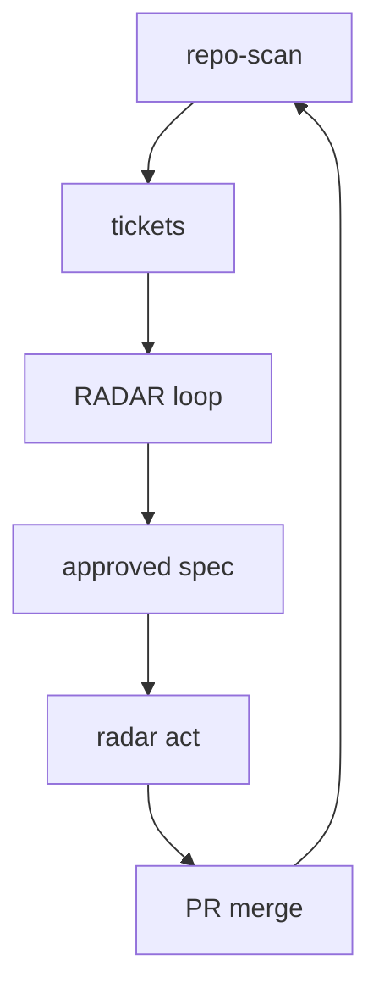
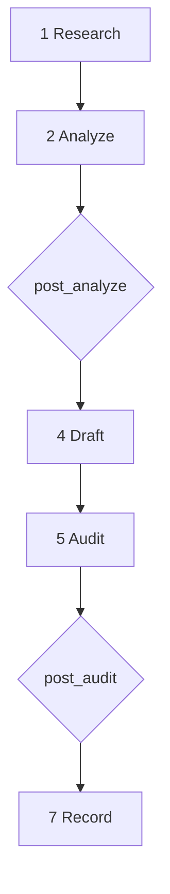

# Agentic loop — ground truth

_Canonical RADAR behavior. Agents, daemons, and humans should match these flows._

**Related:** [[NORTH_STAR]] · [[RADAR_CONTEXT]] · [[research/theory]] · [[architecture/graph-viewer-roadmap]]

---

## How to read this page

**Obsidian:** prefer the **ASCII diagrams** below — they fit the pane width with no
horizontal scroll. Mermaid blocks are optional supplements; keep them `graph TD`
(vertical) only. For pan/zoom and live linking, see [[architecture/graph-viewer-roadmap]]
(hub graph viewer — planned).

**GitHub / editors:** ASCII and tables render everywhere; Mermaid works in the README
and on github.com.

---

## Lifecycle

```
repo-scan
    │
tickets  (proposed → approved)
    │
RADAR loop  (7 stages, 2 gates)
    │
approved spec  (docs/specs)
    │
radar act  (5 stages, 2 gates)
    │
PR merge
    │
repo-scan  ◄── rescan closes the loop
```

| Stage | Command | Outcome |
|-------|---------|---------|
| Monitor | `repo-scan` / daemon rescan | `docs/` vault, `scan.json`, auto-tickets |
| Research | `radar loop` / `radar full` | sources, analysis, draft spec |
| Record | loop gate 2 pass | `docs/specs/*` status `approved` |
| Implement | `radar act` / daemon | `radar/tkt-*` branch + commit |
| Close loop | human merge + rescan | metrics delta, ticket → done |

<details>
<summary>Mermaid (vertical — optional)</summary>



</details>

---

## RADAR loop (7 stages)

Checkpointed — resume skips completed LLM stages.

```
1 Research     propose + ingest sources
      │
2 Analyze      findings → repo files
      │
 ◇ post_analyze gate
      │
4 Draft        implementation spec
      │
5 Audit        Reflexion + revise
      │
 ◇ post_audit gate
      │
7 Record       spec status: approved
```

**Triggers:** approved ticket · manual URL/arXiv/file · metric candidate.

**Artifacts:** `research/sources/`, `research/analysis/`, `specs/`, `changelog/*-loop.md`.

<details>
<summary>Mermaid (vertical — optional)</summary>



</details>

---

## RADAR act (5 stages)

Tests are a hard gate. Never runs on a dirty tree or the user's branch.

```
pick ticket + spec wikilink
      │
 ◇ pre_implement gate
      │
3 Implement    agent CLI on radar/tkt branch
      │
4 Test         must pass; bounded fix rounds
      │
 ◇ post_implement gate
      │
commit on branch  →  human squash-merge
```

Parallel acts use isolated git worktrees (`max_parallel_acts`).

---

## Gates — pause and resume

`prompt` → `docs/research/pending/{gate}-{problem}.json`, checkpoint, exit.
`auto` → pass. `deny` → stop. All decisions → `docs/research/decisions.md`.

```
loop/act hits prompt gate
      │
write pending/*.json + checkpoint
      │
exit (daemon marks waiting-on-gate)
      │
hub or CLI: approve / reject
      │
daemon resumes same problem
      │
skip stages already in checkpoint
```

| Gate | When | Resume |
|------|------|--------|
| `post_analyze` | after Analyze | `radar loop --approve post_analyze` |
| `post_audit` | after Audit | `radar loop --approve post_audit` |
| `pre_implement` | before branch | `radar act --approve pre_implement` |
| `post_implement` | before commit | `radar act --approve post_implement` |

Per-kind overrides: `gates_by_kind` in `.repo-scan.json`.

---

## Daemon tick (`radar serve`)

```
1 resume gate-waiting runs
      │
2 rescan if stale → new tickets
      │
3 fan-out acts in worktrees
      │
4 start next approved loop
```

Daily `budget_daily_tokens` / `max_acts_per_day` block **starting** new work only.

---

## Ground-truth hierarchy

When artifacts conflict:

1. `docs/tickets/tkt-*.md`
2. `docs/specs/*` (`status: approved`)
3. `docs/research/analysis/*`
4. `docs/research/sources/*` (Notes)
5. `scan.json`
6. derived indexes
7. ephemeral `repo_snapshot()` / prompts

---

## Invariants

> [!important] Agents must respect
> - Write durable artifacts to `docs/` — never treat LLM context as canonical.
> - Checkpoints prevent re-running expensive completed stages on resume.
> - Every gate decision is logged; `prompt` gates block until answered.
> - Act: tests pass before `post_implement`; protected paths force human review.
> - Vault auto-commit scopes to `docs/` only — human code staging is untouched.
