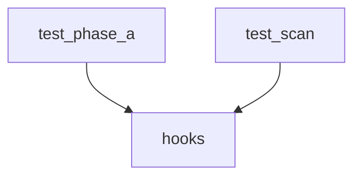

# Dependency graph
_Generated 2026-06-09 22:43 UTC_

## TypeScript / JavaScript

_Skipped: no TS/JS files_

## Python

```mermaid
graph TD
  tests_test_phase_a["test_phase_a"] --> repo_scan_hooks["hooks"]
  tests_test_scan["test_scan"] --> repo_scan_hooks["hooks"]
```
