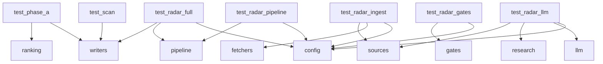

# Dependency graph
_Generated 2026-06-10 00:00 UTC_

## TypeScript / JavaScript

_Skipped: no TS/JS files_

## Python

```mermaid
graph TD
  tests_test_phase_a["test_phase_a"] --> repo_scan_writers["writers"]
  tests_test_phase_a["test_phase_a"] --> repo_scan_ranking["ranking"]
  tests_test_radar_ingest["test_radar_ingest"] --> repo_scan_config["config"]
  tests_test_radar_ingest["test_radar_ingest"] --> repo_scan_radar_fetchers["fetchers"]
  tests_test_radar_ingest["test_radar_ingest"] --> repo_scan_radar_sources["sources"]
  tests_test_scan["test_scan"] --> repo_scan_writers["writers"]
  tests_test_radar_pipeline["test_radar_pipeline"] --> repo_scan_config["config"]
  tests_test_radar_pipeline["test_radar_pipeline"] --> repo_scan_radar_pipeline["pipeline"]
  tests_test_radar_llm["test_radar_llm"] --> repo_scan_config["config"]
  tests_test_radar_llm["test_radar_llm"] --> repo_scan_radar_llm["llm"]
  tests_test_radar_llm["test_radar_llm"] --> repo_scan_radar_research["research"]
  tests_test_radar_llm["test_radar_llm"] --> repo_scan_radar_sources["sources"]
  tests_test_radar_gates["test_radar_gates"] --> repo_scan_config["config"]
  tests_test_radar_gates["test_radar_gates"] --> repo_scan_radar_gates["gates"]
  tests_test_radar_full["test_radar_full"] --> repo_scan_config["config"]
  tests_test_radar_full["test_radar_full"] --> repo_scan_radar_pipeline["pipeline"]
  tests_test_radar_full["test_radar_full"] --> repo_scan_writers["writers"]
```
