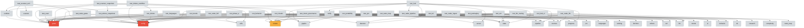

# Dependency graph
_Generated 2026-06-10 09:06 UTC_

_Node color = PageRank tier: red = hub, amber = mid, gray = leaf._

## TypeScript / JavaScript

_Skipped: no TS/JS files_

## Python

```mermaid
graph TD
  tests_conftest["conftest"] --> repo_scan_radar_gates["gates"]
  tests_test_prs["test_prs"] --> repo_scan_config["config"]
  tests_test_prs["test_prs"] --> repo_scan_hub_progress["progress"]
  tests_test_prs["test_prs"] --> repo_scan_hub_prs["prs"]
  tests_test_prs["test_prs"] --> repo_scan_tickets["tickets"]
  tests_test_prs["test_prs"] --> repo_scan_hub_state["state"]
  tests_test_prs["test_prs"] --> repo_scan_hub_server["server"]
  tests_test_scanner_unit["test_scanner_unit"] --> repo_scan_radar_gates["gates"]
  tests_test_scanner_unit["test_scanner_unit"] --> repo_scan_config["config"]
  tests_test_scanner_unit["test_scanner_unit"] --> repo_scan_scanner["scanner"]
  tests_test_scanner_unit["test_scanner_unit"] --> tests_conftest["conftest"]
  tests_test_scanner_unit["test_scanner_unit"] --> tests_test_writers_snapshots["test_writers_snapshots"]
  tests_test_languages["test_languages"] --> repo_scan_config["config"]
  tests_test_languages["test_languages"] --> repo_scan_languages["languages"]
  tests_test_languages["test_languages"] --> repo_scan_radar_gates["gates"]
  tests_test_phase_a["test_phase_a"] --> repo_scan_radar_gates["gates"]
  tests_test_phase_a["test_phase_a"] --> repo_scan_ranking["ranking"]
  tests_test_radar_ingest["test_radar_ingest"] --> repo_scan_config["config"]
  tests_test_radar_ingest["test_radar_ingest"] --> repo_scan_radar_fetchers["fetchers"]
  tests_test_radar_ingest["test_radar_ingest"] --> repo_scan_radar_sources["sources"]
  tests_test_writers_snapshots["test_writers_snapshots"] --> repo_scan_radar_gates["gates"]
  tests_test_writers_snapshots["test_writers_snapshots"] --> repo_scan_config["config"]
  tests_test_writers_snapshots["test_writers_snapshots"] --> repo_scan_utils["utils"]
  tests_test_tickets_workflow["test_tickets_workflow"] --> repo_scan_radar_gates["gates"]
  tests_test_tickets_workflow["test_tickets_workflow"] --> repo_scan_config["config"]
  tests_test_tickets_workflow["test_tickets_workflow"] --> repo_scan_tickets["tickets"]
  tests_test_tickets_workflow["test_tickets_workflow"] --> tests_test_tickets["test_tickets"]
  tests_test_visuals["test_visuals"] --> repo_scan_radar_gates["gates"]
  tests_test_visuals["test_visuals"] --> repo_scan_graphs["graphs"]
  tests_test_visuals["test_visuals"] --> repo_scan_utils["utils"]
  tests_test_visuals["test_visuals"] --> repo_scan_writers["writers"]
  tests_test_intent_governance["test_intent_governance"] --> repo_scan_config["config"]
  tests_test_intent_governance["test_intent_governance"] --> repo_scan_hub_daemon["daemon"]
  tests_test_intent_governance["test_intent_governance"] --> repo_scan_hub_state["state"]
  tests_test_intent_governance["test_intent_governance"] --> repo_scan_radar_act["act"]
  tests_test_intent_governance["test_intent_governance"] --> repo_scan_radar_gates["gates"]
  tests_test_intent_governance["test_intent_governance"] --> repo_scan_radar_llm["llm"]
  tests_test_intent_governance["test_intent_governance"] --> repo_scan_radar_pipeline["pipeline"]
  tests_test_intent_governance["test_intent_governance"] --> repo_scan_tickets["tickets"]
  tests_test_trends["test_trends"] --> repo_scan_radar_gates["gates"]
  tests_test_trends["test_trends"] --> repo_scan_config["config"]
  tests_test_trends["test_trends"] --> repo_scan_trends["trends"]
  tests_test_hub_ui["test_hub_ui"] --> repo_scan_hub_ui["ui"]
  tests_test_hub_ui["test_hub_ui"] --> repo_scan_tickets["tickets"]
  tests_test_packaging["test_packaging"] --> repo_scan_behavior["behavior"]
  tests_test_packaging["test_packaging"] --> repo_scan_config["config"]
  tests_test_scan["test_scan"] --> repo_scan_radar_gates["gates"]
  tests_test_tui["test_tui"] --> repo_scan_config["config"]
  tests_test_tui["test_tui"] --> repo_scan_hub_state["state"]
  tests_test_tui["test_tui"] --> repo_scan_hub_tui["tui"]
  tests_test_tui["test_tui"] --> repo_scan_tickets["tickets"]
  tests_test_radar_pipeline["test_radar_pipeline"] --> repo_scan_config["config"]
  tests_test_radar_pipeline["test_radar_pipeline"] --> repo_scan_radar_pipeline["pipeline"]
  tests_test_radar_pipeline["test_radar_pipeline"] --> repo_scan_radar_sources["sources"]
  tests_test_behavior["test_behavior"] --> repo_scan_radar_gates["gates"]
  tests_test_behavior["test_behavior"] --> repo_scan_behavior["behavior"]
  tests_test_behavior["test_behavior"] --> repo_scan_config["config"]
  tests_test_radar_llm["test_radar_llm"] --> repo_scan_config["config"]
  tests_test_radar_llm["test_radar_llm"] --> repo_scan_radar_llm["llm"]
  tests_test_radar_llm["test_radar_llm"] --> repo_scan_radar_research["research"]
  tests_test_radar_llm["test_radar_llm"] --> repo_scan_radar_sources["sources"]
  tests_test_radar_gates["test_radar_gates"] --> repo_scan_config["config"]
  tests_test_radar_gates["test_radar_gates"] --> repo_scan_radar_gates["gates"]
  tests_test_scanner_snapshots["test_scanner_snapshots"] --> repo_scan_radar_gates["gates"]
  tests_test_scanner_snapshots["test_scanner_snapshots"] --> repo_scan_utils["utils"]
  tests_test_scanner_snapshots["test_scanner_snapshots"] --> tests_conftest["conftest"]
  tests_test_scanner_snapshots["test_scanner_snapshots"] --> tests_test_writers_snapshots["test_writers_snapshots"]
  tests_test_scanner_snapshots["test_scanner_snapshots"] --> repo_scan_graphs["graphs"]
  tests_test_portability["test_portability"] --> repo_scan_radar_gates["gates"]
  tests_test_portability["test_portability"] --> repo_scan_complexity["complexity"]
  tests_test_portability["test_portability"] --> repo_scan_config["config"]
  tests_test_portability["test_portability"] --> repo_scan_graphs["graphs"]
  tests_test_portability["test_portability"] --> repo_scan_languages["languages"]
  tests_test_llm_routing["test_llm_routing"] --> repo_scan_config["config"]
  tests_test_llm_routing["test_llm_routing"] --> repo_scan_radar_llm["llm"]
  tests_test_llm_routing["test_llm_routing"] --> repo_scan_hub_state["state"]
  tests_test_tickets["test_tickets"] --> repo_scan_radar_gates["gates"]
  tests_test_tickets["test_tickets"] --> repo_scan_config["config"]
  tests_test_tickets["test_tickets"] --> repo_scan_tickets["tickets"]
  tests_test_tests_map["test_tests_map"] --> repo_scan_radar_gates["gates"]
  tests_test_tests_map["test_tests_map"] --> repo_scan_tests_map["tests_map"]
  tests_test_act["test_act"] --> repo_scan_config["config"]
  tests_test_act["test_act"] --> repo_scan_hub_daemon["daemon"]
  tests_test_act["test_act"] --> repo_scan_hub_state["state"]
  tests_test_act["test_act"] --> repo_scan_radar_act["act"]
  tests_test_act["test_act"] --> repo_scan_tickets["tickets"]
  tests_test_act["test_act"] --> repo_scan_hub_progress["progress"]
  tests_test_radar_full["test_radar_full"] --> repo_scan_config["config"]
  tests_test_radar_full["test_radar_full"] --> repo_scan_radar_pipeline["pipeline"]
  tests_test_radar_full["test_radar_full"] --> repo_scan_radar_gates["gates"]
  tests_test_hub["test_hub"] --> repo_scan_config["config"]
  tests_test_hub["test_hub"] --> repo_scan_hub_daemon["daemon"]
  tests_test_hub["test_hub"] --> repo_scan_hub_server["server"]
  tests_test_hub["test_hub"] --> repo_scan_hub_state["state"]
  tests_test_hub["test_hub"] --> repo_scan_radar_gates["gates"]
  tests_test_hub["test_hub"] --> repo_scan_radar_pipeline["pipeline"]
  tests_test_hub["test_hub"] --> repo_scan_tickets["tickets"]
  tests_test_hub["test_hub"] --> tests_test_radar_pipeline["test_radar_pipeline"]
  tests_test_hub["test_hub"] --> repo_scan_hub_notify["notify"]
  tests_test_hub["test_hub"] --> repo_scan_hub_progress["progress"]
  classDef hot fill:#e74c3c,stroke:#922b21,color:#fff
  classDef warm fill:#f5b041,stroke:#b9770e,color:#1a1a1a
  classDef cold fill:#d6dbdf,stroke:#85929e,color:#1a1a1a
  class repo_scan_config,repo_scan_radar_gates hot
  class repo_scan_tickets warm
  class repo_scan_behavior,repo_scan_complexity,repo_scan_graphs,repo_scan_hub_daemon,repo_scan_hub_notify,repo_scan_hub_progress,repo_scan_hub_prs,repo_scan_hub_server,repo_scan_hub_state,repo_scan_hub_tui,repo_scan_hub_ui,repo_scan_languages,repo_scan_radar_act,repo_scan_radar_fetchers,repo_scan_radar_llm,repo_scan_radar_pipeline,repo_scan_radar_research,repo_scan_radar_sources,repo_scan_ranking,repo_scan_scanner,repo_scan_tests_map,repo_scan_trends,repo_scan_utils,repo_scan_writers,tests_conftest,tests_test_act,tests_test_behavior,tests_test_hub,tests_test_hub_ui,tests_test_intent_governance,tests_test_languages,tests_test_llm_routing,tests_test_packaging,tests_test_phase_a,tests_test_portability,tests_test_prs,tests_test_radar_full,tests_test_radar_gates,tests_test_radar_ingest,tests_test_radar_llm,tests_test_radar_pipeline,tests_test_scan,tests_test_scanner_snapshots,tests_test_scanner_unit,tests_test_tests_map,tests_test_tickets,tests_test_tickets_workflow,tests_test_trends,tests_test_tui,tests_test_visuals,tests_test_writers_snapshots cold
```
