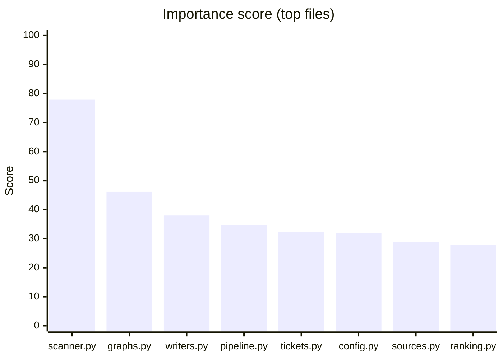
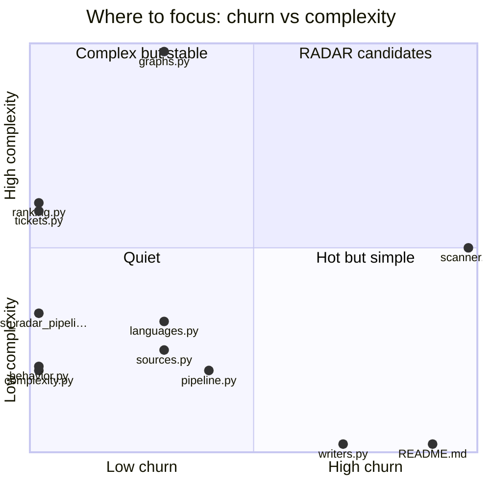

# Repo index
_Last scan: 2026-06-10 02:07 UTC_

> Repo intelligence tool. Run it against any codebase — analyzes structure, generates dependency and call graphs as Mermaid diagrams, scores complexity, tracks git churn, writes everything to `docs/` committed to git and readable in Obsidian.

> [!note] No critical files; 3 file(s) above the 300-line watermark

> [!note] Since last scan (2026-06-10 01:21 UTC)
> lines +325, files +2, hotspot functions -1, critical files 0
> - `repo_scan/writers.py` complexity -52
> - `repo_scan/tickets.py` complexity +14
> - `repo_scan/scanner.py` complexity +1

## Overview

| Metric | Value |
|--------|-------|
| Source files | 45 |
| Total lines | 4,586 |
| Languages | PY: 45 |
| Large files (>300 lines) | 3 |
| Critical files (>600 lines) | 0 |
| Branch | main |
| Last commit | 95fcbf7 feat: C3 ticket workflow — review CLI, approved-ticket radar queue, metrics-resolved flags |
| Remote | https://github.com/hhleroy97/repo-scan.git |
| Manifests | `pyproject.toml`, `setup.py` |

## Entry points

- `repo-scan` → repo_scan:main (pyproject)
- `radar` → repo_scan.radar.cli:main (pyproject)

## Start here (ranked by importance)

_Composite of import-graph PageRank × git churn × complexity × size._
_"Imported by" counts direct dependents only; PageRank captures transitive importance._

| File | Score | PageRank | Imported by | Commits | CC | Lines | Tests |
|------|-------|----------|-------------|---------|----|-------|-------|
| `repo_scan/scanner.py` | 77.9 | 0.1039 | 11 | 10 | 28 | 151 | **no** |
| `repo_scan/graphs.py` | 46.2 | 0.0301 | 2 | 3 | 56 | 140 | **no** |
| `repo_scan/writers.py` | 38.0 | 0.0264 | 1 | 7 | 0 | 485 | yes |
| `repo_scan/radar/pipeline.py` | 34.7 | 0.0372 | 2 | 4 | 11 | 310 | yes |
| `repo_scan/tickets.py` | 32.4 | 0.0339 | 2 | 0 | 33 | 303 | yes |
| `repo_scan/config.py` | 31.9 | 0.0916 | 11 | 0 | 0 | 49 | **no** |
| `repo_scan/radar/sources.py` | 28.8 | 0.0326 | 2 | 3 | 14 | 166 | **no** |
| `repo_scan/ranking.py` | 27.8 | 0.0310 | 1 | 0 | 34 | 106 | **no** |
| `repo_scan/languages.py` | 26.2 | 0.0255 | 1 | 3 | 18 | 66 | **no** |
| `README.md` | 24.5 | 0.0000 | 0 | 9 | 0 | 0 | **no** |
| `tests/test_radar_pipeline.py` | 18.1 | 0.0218 | 0 | 0 | 19 | 113 | yes |
| `repo_scan/behavior.py` | 16.9 | 0.0279 | 1 | 0 | 12 | 102 | yes |
| `repo_scan/complexity.py` | 15.4 | 0.0255 | 1 | 0 | 11 | 91 | **no** |
| `tests/test_trends.py` | 14.8 | 0.0218 | 0 | 0 | 14 | 61 | yes |
| `pyproject.toml` | 14.0 | 0.0000 | 0 | 5 | 0 | 16 | **no** |





## Structure

```
repo-scan/
├── docs/
│   ├── architecture/
│   │   └── dependency-graph.md
│   ├── changelog/
│   │   ├── 2026-06-09-assessment-hardening.md
│   │   ├── 2026-06-09-loop.md
│   │   ├── 2026-06-09-no-emoji-docs.md
│   │   ├── 2026-06-09-obsidian-graph.md
│   │   ├── 2026-06-09-pagerank-ranking.md
│   │   ├── 2026-06-09-phase-a.md
│   │   ├── 2026-06-09-phase-a2-split.md
│   │   ├── 2026-06-09-phase-b1-ingest.md
│   │   ├── 2026-06-09-phase-b2-research.md
│   │   ├── 2026-06-09-phase-b3-loop.md
│   │   ├── 2026-06-09-phase-b4-autonomy.md
│   │   ├── 2026-06-09-portability-fixes.md
│   │   ├── 2026-06-09-visual-layer.md
│   │   ├── 2026-06-10-behavior-and-tickets.md
│   │   ├── 2026-06-10-loop.md
│   │   └── 2026-06-10-phase-c3-workflow.md
│   ├── reports/
│   │   ├── calls.md
│   │   ├── coupling.md
│   │   ├── dependencies.md
│   │   ├── health.md
│   │   └── trend.md
│   ├── research/
│   │   ├── analysis/
│   │   ├── pending/
│   │   ├── runs/
│   │   ├── sources/
│   │   ├── candidates.md
│   │   ├── decisions.md
│   │   ├── index.md
│   │   └── tags.md
│   ├── specs/
│   │   ├── 2026-06-09-should-repo-scan-replace-its-heuristic-i-spec.md
│   │   └── 2026-06-10-refactor-repo-scan-writers-py-cc-52-7-co-spec.md
│   ├── tickets/
│   │   ├── board.md
│   │   ├── tkt-0001.md
│   │   ├── tkt-0002.md
│   │   ├── tkt-0003.md
│   │   ├── tkt-0004.md
│   │   ├── tkt-0005.md
│   │   ├── tkt-0006.md
│   │   ├── tkt-0007.md
│   │   └── tkt-0008.md
│   ├── digest.md
│   ├── index.md
│   ├── RADAR_CONTEXT.md
│   └── scan.json
├── repo_scan/
│   ├── radar/
│   │   ├── __init__.py
│   │   ├── cli.py
│   │   ├── fetchers.py
│   │   ├── gates.py
│   │   ├── llm.py
│   │   ├── pipeline.py
│   │   ├── research.py
│   │   └── sources.py
│   ├── __init__.py
│   ├── behavior.py
│   ├── churn.py
│   ├── cli.py
│   ├── complexity.py
│   ├── config.py
│   ├── digest.py
│   ├── graphs.py
│   ├── handoff.py
│   ├── hooks.py
│   ├── identity.py
│   ├── languages.py
│   ├── ranking.py
│   ├── scanner.py
│   ├── tests_map.py
│   ├── tickets.py
│   ├── trends.py
│   ├── utils.py
│   └── writers.py
├── repo_scan.egg-info/
│   ├── dependency_links.txt
│   ├── entry_points.txt
│   ├── PKG-INFO
│   ├── SOURCES.txt
│   └── top_level.txt
├── tests/
│   ├── __snapshots__/
│   │   └── test_writers_snapshots.ambr
│   ├── conftest.py
│   ├── fake_llm.py
│   ├── test_behavior.py
│   ├── test_phase_a.py
│   ├── test_portability.py
│   ├── test_radar_full.py
│   ├── test_radar_gates.py
│   ├── test_radar_ingest.py
│   ├── test_radar_llm.py
│   ├── test_radar_pipeline.py
│   ├── test_scan.py
│   ├── test_tests_map.py
│   ├── test_tickets.py
│   ├── test_tickets_workflow.py
│   ├── test_trends.py
│   ├── test_visuals.py
│   └── test_writers_snapshots.py
├── .gitignore
├── .repo-scan.json
├── pyproject.toml
├── README.md
└── setup.py
```

## Reports

- [[reports/health]] — file sizes, complexity, git churn
- [[reports/dependencies]] — dependency graphs (Mermaid)
- [[reports/calls]] — call graphs (Mermaid)

## Architecture

- [[architecture/dependency-graph]] — stable dep graph for cross-linking
- [[architecture/overview]] — hand-written system overview _(create this)_

## Research

- [[research/index]] — ingested sources _(populated by RADAR)_
- [[research/theory]] — distilled understanding _(yours to write)_
