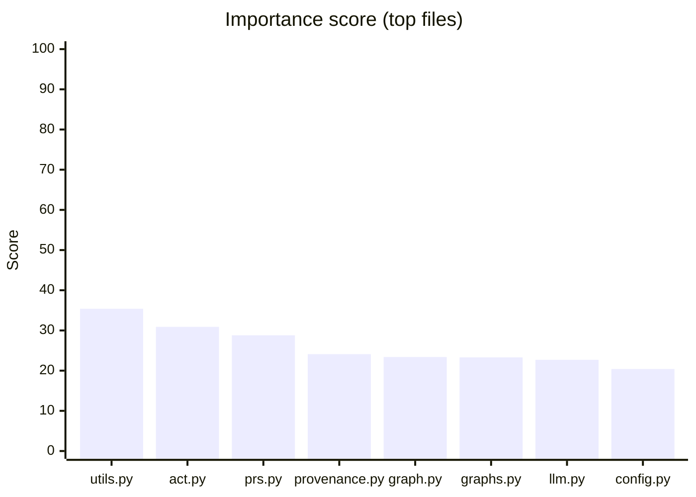
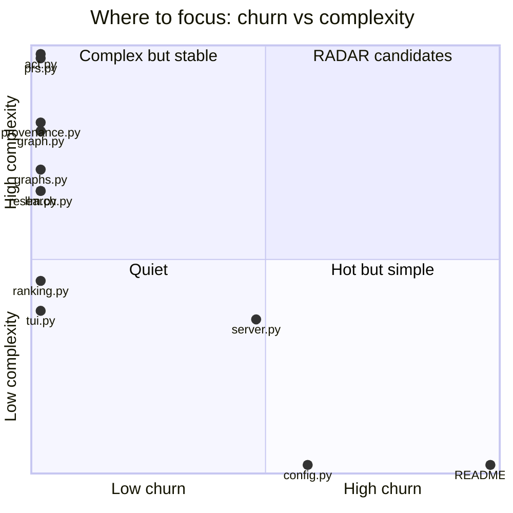

# Repo index
_Last scan: 2026-06-10 21:57 UTC_

> Repo intelligence tool. Run it against any codebase — analyzes structure, generates dependency and call graphs as Mermaid diagrams, scores complexity, tracks git churn, writes everything to `docs/` committed to git and readable in Obsidian.

> [!warning] 1 file(s) exceed 600 lines — see [[reports/health]]
> Largest: `repo_scan/hub/static/mermaid.min.js` (2028 lines)

> [!note] Since last scan (2026-06-10 21:18 UTC)
> lines +3, files 0, hotspot functions 0, critical files 0
> - `repo_scan/provenance.py` complexity +2

## Overview

| Metric | Value |
|--------|-------|
| Source files | 120 |
| Total lines | 17,781 |
| Languages | TS: 1, PY: 119 |
| Large files (>300 lines) | 11 |
| Critical files (>600 lines) | 1 |
| Branch | main |
| Last commit | 138de87 vault: loop artifacts — tkt-0018 |
| Remote | https://github.com/hhleroy97/repo-scan.git |
| Manifests | `pyproject.toml` |

## Entry points

- `repo-scan` → repo_scan:main (pyproject)
- `radar` → repo_scan.radar.cli:main (pyproject)

## Start here (ranked by importance)

_Composite of import-graph PageRank × git churn × complexity × size._
_"Imported by" counts direct dependents only; PageRank captures transitive importance._

| File | Score | PageRank | Imported by | Commits | CC | Lines | Tests |
|------|-------|----------|-------------|---------|----|-------|-------|
| `repo_scan/utils.py` | 35.4 | 0.1332 | 30 | 0 | 0 | 84 | **no** |
| `repo_scan/radar/act.py` | 30.9 | 0.0122 | 13 | 0 | 76 | 539 | yes |
| `repo_scan/hub/prs.py` | 28.8 | 0.0069 | 6 | 0 | 74 | 530 | yes |
| `repo_scan/provenance.py` | 24.1 | 0.0092 | 5 | 0 | 62 | 265 | yes |
| `repo_scan/hub/graph.py` | 23.4 | 0.0062 | 3 | 0 | 61 | 340 | yes |
| `repo_scan/graphs.py` | 23.3 | 0.0157 | 8 | 0 | 54 | 282 | yes |
| `repo_scan/radar/llm.py` | 22.7 | 0.0186 | 16 | 0 | 50 | 272 | yes |
| `repo_scan/config.py` | 20.4 | 0.0474 | 41 | 16 | 0 | 71 | **no** |
| `repo_scan/radar/research.py` | 19.8 | 0.0079 | 5 | 0 | 50 | 265 | **no** |
| `repo_scan/hub/server.py` | 19.1 | 0.0084 | 6 | 13 | 27 | 378 | **no** |
| `repo_scan/ranking.py` | 14.8 | 0.0118 | 4 | 0 | 34 | 106 | **no** |
| `repo_scan/hub/state.py` | 14.0 | 0.0493 | 39 | 0 | 0 | 210 | **no** |
| `README.md` | 12.9 | 0.0000 | 0 | 27 | 0 | 0 | **no** |
| `repo_scan/hub/tui.py` | 12.2 | 0.0056 | 2 | 0 | 29 | 233 | yes |
| `repo_scan/radar/pipeline.py` | 11.9 | 0.0120 | 13 | 13 | 0 | 515 | yes |





## Structure

```
repo-scan/
├── docs/
│   ├── architecture/
│   │   ├── agentic-loop.md
│   │   ├── dependency-graph.md
│   │   └── graph-viewer-roadmap.md
│   ├── changelog/
│   │   ├── 2026-06-09-assessment-hardening.md
│   │   ├── 2026-06-09-loop.md
│   │   ├── 2026-06-09-no-emoji-docs.md
│   │   ├── 2026-06-09-obsidian-graph.md
│   │   ├── 2026-06-09-pagerank-ranking.md
│   │   ├── 2026-06-09-phase-a.md
│   │   ├── 2026-06-09-phase-a2-split.md
│   │   ├── 2026-06-09-phase-b1-ingest.md
│   │   ├── 2026-06-09-phase-b2-research.md
│   │   ├── 2026-06-09-phase-b3-loop.md
│   │   ├── 2026-06-09-phase-b4-autonomy.md
│   │   ├── 2026-06-09-portability-fixes.md
│   │   ├── 2026-06-09-visual-layer.md
│   │   ├── 2026-06-10-act-doc-drift.md
│   │   ├── 2026-06-10-act-stage.md
│   │   ├── 2026-06-10-act.md
│   │   ├── 2026-06-10-agent-factory.md
│   │   ├── 2026-06-10-agent-feedback.md
│   │   ├── 2026-06-10-behavior-and-tickets.md
│   │   ├── 2026-06-10-gate-drawer.md
│   │   ├── 2026-06-10-hub-loading-states.md
│   │   ├── 2026-06-10-hub-sse.md
│   │   ├── 2026-06-10-intent-governance.md
│   │   ├── 2026-06-10-live-run-panel.md
│   │   ├── 2026-06-10-llm-liveness.md
│   │   ├── 2026-06-10-llm-null-byte-fix.md
│   │   ├── 2026-06-10-loop.md
│   │   ├── 2026-06-10-mobile-hub.md
│   │   ├── 2026-06-10-now-tab-layout.md
│   │   ├── 2026-06-10-parallel-loops.md
│   │   ├── 2026-06-10-phase-c3-workflow.md
│   │   ├── 2026-06-10-phase2-freshness.md
│   │   ├── 2026-06-10-pipeline-telemetry.md
│   │   ├── 2026-06-10-pr-merge-ui.md
│   │   ├── 2026-06-10-pr-remediate.md
│   │   ├── 2026-06-10-repo-snapshot.md
│   │   ├── 2026-06-10-tkt-0001-writers-refactor.md
│   │   ├── 2026-06-10-vault-autocommit.md
│   │   ├── 2026-06-11-citation-scanner.md
│   │   └── 2026-06-11-vault-provenance.md
│   ├── planning/
│   │   ├── phase-1-week1.md
│   │   ├── phase-2-week2.md
│   │   ├── phase-3-week3.md
│   │   ├── phase-4-week4.md
│   │   ├── phase-5-week5.md
│   │   └── README.md
│   ├── reports/
│   │   ├── calls.md
│   │   ├── coupling.md
│   │   ├── dependencies.md
│   │   ├── health.md
│   │   └── trend.md
│   ├── research/
│   │   ├── analysis/
│   │   ├── pending/
│   │   ├── runs/
│   │   ├── sources/
│   │   ├── candidates.md
│   │   ├── decisions.md
│   │   ├── index.md
│   │   ├── tags.md
│   │   └── theory.md
│   ├── specs/
│   │   ├── 2026-06-09-should-repo-scan-replace-its-heuristic-i-spec.md
│   │   ├── 2026-06-10-add-a-list-for-the-open-tickets-to-the-n-spec.md
│   │   ├── 2026-06-10-convert-tickets-to-most-human-friendly-t-spec.md
│   │   ├── 2026-06-10-hidden-seam-pyproject-toml-setup-py-100-spec.md
│   │   ├── 2026-06-10-hidden-seam-repo-scan-config-py-repo-sca-spec.md
│   │   ├── 2026-06-10-hidden-seam-repo-scan-hub-daemon-py-test-spec.md
│   │   ├── 2026-06-10-hidden-seam-repo-scan-hub-server-py-repo-spec.md
│   │   ├── 2026-06-10-hidden-seam-repo-scan-radar-cli-py-repo-spec.md
│   │   ├── 2026-06-10-hidden-seam-repo-scan-scanner-py-repo-sc-spec.md
│   │   ├── 2026-06-10-i-want-to-add-a-more-robust-way-to-visua-spec.md
│   │   ├── 2026-06-10-move-the-agentic-loop-graph-and-untracke-spec.md
│   │   ├── 2026-06-10-refactor-repo-scan-graphs-py-cc-56-3-com-spec.md
│   │   ├── 2026-06-10-refactor-repo-scan-hub-daemon-py-cc-38-1-spec.md
│   │   ├── 2026-06-10-refactor-repo-scan-languages-py-cc-18-3-spec.md
│   │   ├── 2026-06-10-refactor-repo-scan-radar-pipeline-py-cc-spec.md
│   │   ├── 2026-06-10-refactor-repo-scan-radar-sources-py-cc-1-spec.md
│   │   ├── 2026-06-10-refactor-repo-scan-scanner-py-cc-27-8-co-spec.md
│   │   ├── 2026-06-10-refactor-repo-scan-writers-py-cc-52-7-co-spec.md
│   │   ├── 2026-06-10-refactor-tests-test-radar-pipeline-py-cc-spec.md
│   │   ├── 2026-06-10-split-repo-scan-hub-ui-py-706-lines-repo-spec.md
│   │   └── 2026-06-10-split-repo-scan-tickets-py-654-lines-rep-spec.md
│   ├── tickets/
│   │   ├── board.md
│   │   ├── tkt-0001.md
│   │   ├── tkt-0002.md
│   │   ├── tkt-0003.md
│   │   ├── tkt-0004.md
│   │   ├── tkt-0005.md
│   │   ├── tkt-0006.md
│   │   ├── tkt-0007.md
│   │   ├── tkt-0008.md
│   │   ├── tkt-0009.md
│   │   ├── tkt-0010.md
│   │   ├── tkt-0011.md
│   │   ├── tkt-0012.md
│   │   ├── tkt-0013.md
│   │   ├── tkt-0014.md
│   │   ├── tkt-0015.md
│   │   ├── tkt-0016.md
│   │   ├── tkt-0017.md
│   │   ├── tkt-0018.md
│   │   ├── tkt-0019.md
│   │   ├── tkt-0020.md
│   │   ├── tkt-0021.md
│   │   ├── tkt-0022.md
│   │   ├── tkt-0023.md
│   │   ├── tkt-0024.md
│   │   ├── tkt-0025.md
│   │   ├── tkt-0026.md
│   │   ├── tkt-0027.md
│   │   ├── tkt-0028.md
│   │   ├── tkt-0029.md
│   │   ├── tkt-0030.md
│   │   ├── tkt-0031.md
│   │   ├── tkt-0032.md
│   │   ├── tkt-0033.md
│   │   ├── tkt-0034.md
│   │   ├── tkt-0035.md
│   │   └── tkt-0036.md
│   ├── digest.md
│   ├── index.md
│   ├── NORTH_STAR.md
│   ├── RADAR_CONTEXT.md
│   └── scan.json
├── repo_scan/
│   ├── hub/
│   │   ├── static/
│   │   ├── ui/
│   │   ├── __init__.py
│   │   ├── act_run.py
│   │   ├── agentic_loop.py
│   │   ├── contract.py
│   │   ├── daemon.py
│   │   ├── events.py
│   │   ├── gate_drawer.py
│   │   ├── graph.py
│   │   ├── notify.py
│   │   ├── progress.py
│   │   ├── prs.py
│   │   ├── server.py
│   │   └── …
│   └── …
└── …
```

## Reports

- [[reports/health]] — file sizes, complexity, git churn
- [[reports/dependencies]] — dependency graphs (Mermaid)
- [[reports/calls]] — call graphs (Mermaid)

## Architecture

- [[architecture/dependency-graph]] — stable dep graph for cross-linking
- [[architecture/overview]] — hand-written system overview _(create this)_

## Research

- [[research/index]] — ingested sources _(populated by RADAR)_
- [[research/theory]] — distilled understanding _(yours to write)_

## Action items

- [ ] Split `repo_scan/hub/static/mermaid.min.js` (2028 lines)
