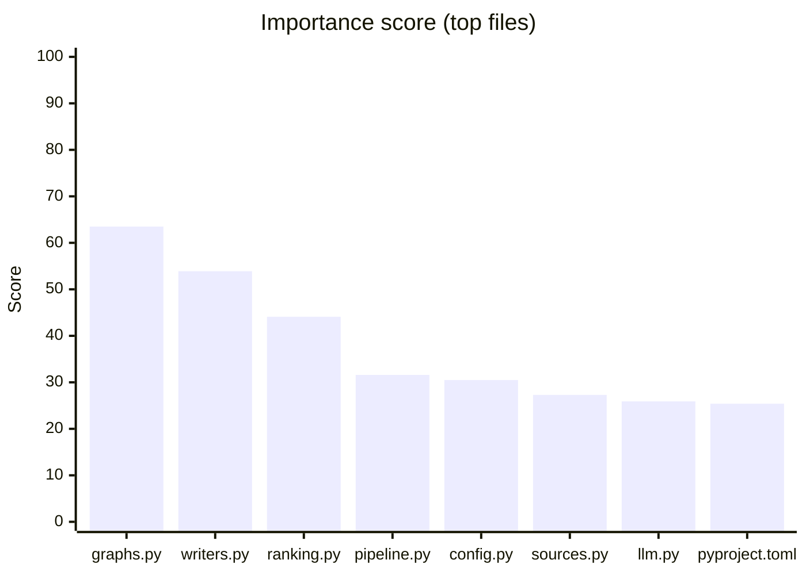
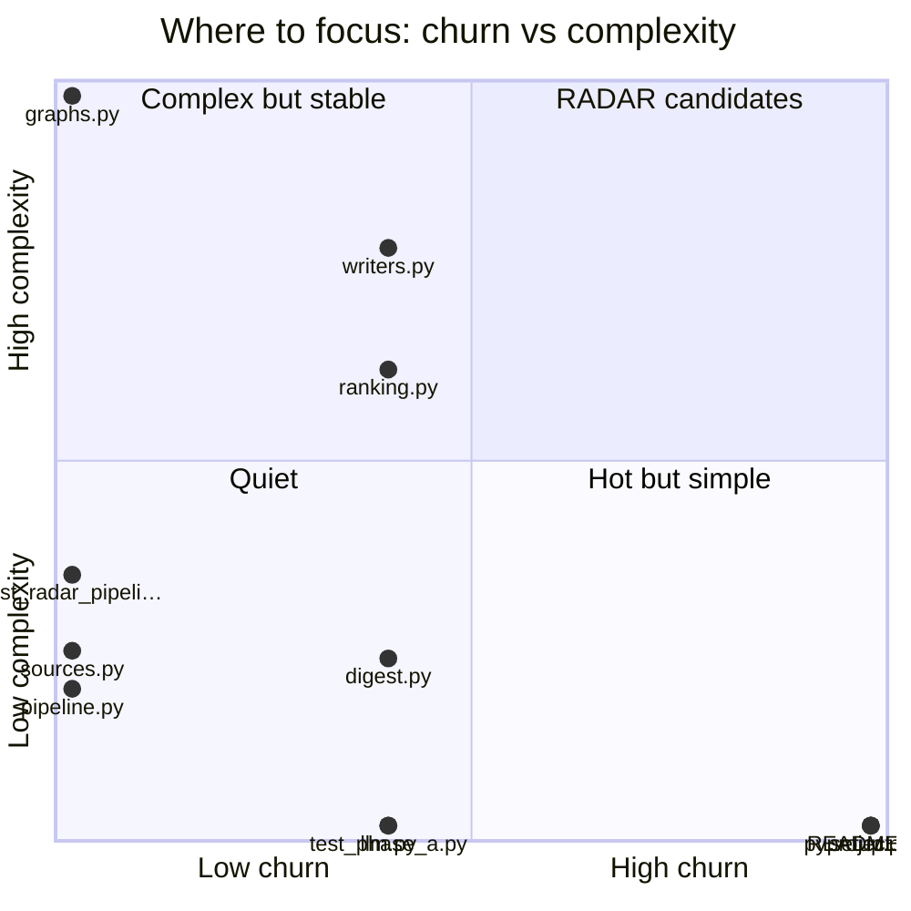

# Repo index
_Last scan: 2026-06-10 00:09 UTC_

> Repo intelligence tool. Run it against any codebase — analyzes structure, generates dependency and call graphs as Mermaid diagrams, scores complexity, tracks git churn, writes everything to `docs/` committed to git and readable in Obsidian.

> [!note] No critical files; 1 file(s) above the 300-line watermark

## Overview

| Metric | Value |
|--------|-------|
| Source files | 34 |
| Total lines | 3,279 |
| Languages | PY: 34 |
| Large files (>300 lines) | 1 |
| Critical files (>600 lines) | 0 |
| Branch | main |
| Last commit | c7c69a2 feat: PageRank centrality in file ranking — first RADAR-loop-driven change (spec approved at Gate 2) |
| Remote | https://github.com/hhleroy97/repo-scan.git |
| Manifests | `pyproject.toml`, `setup.py` |

## Entry points

- `repo-scan` → repo_scan:main (pyproject)
- `radar` → repo_scan.radar.cli:main (pyproject)

## Start here (ranked by importance)

_Composite of import-graph PageRank × git churn × complexity × size._
_"Imported by" counts direct dependents only; PageRank captures transitive importance._

| File | Score | PageRank | Imported by | Commits | CC | Lines |
|------|-------|----------|-------------|---------|----|-------|
| `repo_scan/graphs.py` | 63.5 | 0.1260 | 5 | 0 | 55 | 137 |
| `repo_scan/writers.py` | 53.9 | 0.0517 | 1 | 2 | 43 | 393 |
| `repo_scan/ranking.py` | 44.1 | 0.0575 | 1 | 2 | 34 | 106 |
| `repo_scan/radar/pipeline.py` | 31.6 | 0.0689 | 2 | 0 | 11 | 292 |
| `repo_scan/config.py` | 30.5 | 0.1060 | 5 | 0 | 0 | 42 |
| `repo_scan/radar/sources.py` | 27.3 | 0.0603 | 2 | 0 | 14 | 166 |
| `repo_scan/radar/llm.py` | 25.9 | 0.0489 | 1 | 2 | 0 | 91 |
| `pyproject.toml` | 25.4 | 0.0000 | 0 | 5 | 0 | 14 |
| `setup.py` | 25.3 | 0.0000 | 0 | 5 | 0 | 13 |
| `README.md` | 25.0 | 0.0000 | 0 | 5 | 0 | 0 |
| `tests/test_phase_a.py` | 24.3 | 0.0403 | 0 | 2 | 0 | 123 |
| `tests/test_radar_pipeline.py` | 22.7 | 0.0403 | 0 | 0 | 19 | 113 |
| `repo_scan/radar/fetchers.py` | 18.7 | 0.0517 | 1 | 0 | 0 | 170 |
| `repo_scan/radar/gates.py` | 18.1 | 0.0575 | 1 | 0 | 0 | 85 |
| `repo_scan/digest.py` | 17.1 | 0.0000 | 0 | 2 | 13 | 46 |





## Structure

```
repo-scan/
├── docs/
│   ├── architecture/
│   │   └── dependency-graph.md
│   ├── changelog/
│   │   ├── 2026-06-09-loop.md
│   │   ├── 2026-06-09-obsidian-graph.md
│   │   ├── 2026-06-09-pagerank-ranking.md
│   │   ├── 2026-06-09-phase-a.md
│   │   ├── 2026-06-09-phase-a2-split.md
│   │   ├── 2026-06-09-phase-b1-ingest.md
│   │   ├── 2026-06-09-phase-b2-research.md
│   │   ├── 2026-06-09-phase-b3-loop.md
│   │   └── 2026-06-09-phase-b4-autonomy.md
│   ├── reports/
│   │   ├── calls.md
│   │   ├── dependencies.md
│   │   └── health.md
│   ├── research/
│   │   ├── analysis/
│   │   ├── pending/
│   │   ├── runs/
│   │   ├── sources/
│   │   ├── candidates.md
│   │   ├── decisions.md
│   │   ├── index.md
│   │   └── tags.md
│   ├── specs/
│   │   └── 2026-06-09-should-repo-scan-replace-its-heuristic-i-spec.md
│   ├── digest.md
│   ├── index.md
│   ├── RADAR_CONTEXT.md
│   └── scan.json
├── repo_scan/
│   ├── radar/
│   │   ├── __init__.py
│   │   ├── cli.py
│   │   ├── fetchers.py
│   │   ├── gates.py
│   │   ├── llm.py
│   │   ├── pipeline.py
│   │   ├── research.py
│   │   └── sources.py
│   ├── __init__.py
│   ├── churn.py
│   ├── cli.py
│   ├── complexity.py
│   ├── config.py
│   ├── digest.py
│   ├── graphs.py
│   ├── handoff.py
│   ├── hooks.py
│   ├── identity.py
│   ├── languages.py
│   ├── ranking.py
│   ├── scanner.py
│   ├── utils.py
│   └── writers.py
├── repo_scan.egg-info/
│   ├── dependency_links.txt
│   ├── entry_points.txt
│   ├── PKG-INFO
│   ├── SOURCES.txt
│   └── top_level.txt
├── tests/
│   ├── conftest.py
│   ├── fake_llm.py
│   ├── test_phase_a.py
│   ├── test_radar_full.py
│   ├── test_radar_gates.py
│   ├── test_radar_ingest.py
│   ├── test_radar_llm.py
│   ├── test_radar_pipeline.py
│   ├── test_scan.py
│   └── test_visuals.py
├── .gitignore
├── .repo-scan.json
├── pyproject.toml
├── README.md
├── setup.py
└── Untitled.canvas
```

## Reports

- [[reports/health]] — file sizes, complexity, git churn
- [[reports/dependencies]] — dependency graphs (Mermaid)
- [[reports/calls]] — call graphs (Mermaid)

## Architecture

- [[architecture/dependency-graph]] — stable dep graph for cross-linking
- [[architecture/overview]] — hand-written system overview _(create this)_

## Research

- [[research/index]] — ingested sources _(populated by RADAR)_
- [[research/theory]] — distilled understanding _(yours to write)_
