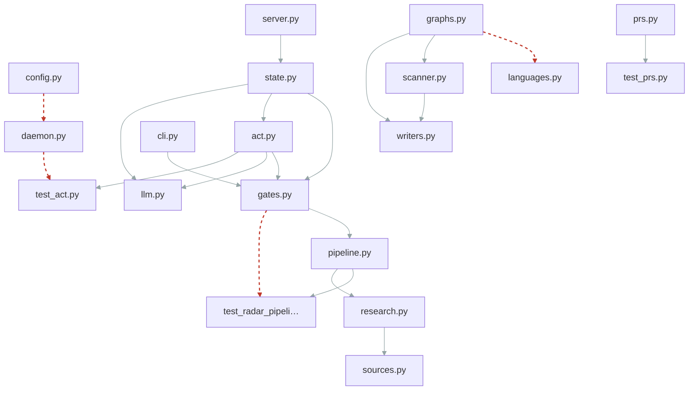

# Change coupling
_Generated 2026-06-11 15:13 UTC_

Files that change together (≥4 shared commits, ≥50% degree).
Coupled pairs **without** an import edge are hidden seams — an implicit
contract the dependency graph can't see.

> [!warning] 4 hidden seam(s): coupled in history, no import edge
> - `repo_scan/graphs.py` ↔ `repo_scan/languages.py` (77% over 5 commits)
> - `repo_scan/hub/daemon.py` ↔ `tests/test_act.py` (62% over 8 commits)
> - `repo_scan/config.py` ↔ `repo_scan/hub/daemon.py` (57% over 10 commits)
> - `repo_scan/radar/gates.py` ↔ `tests/test_radar_pipeline.py` (56% over 5 commits)

| File A | File B | Shared commits | Degree | Import edge |
|--------|--------|----------------|--------|-------------|
| `repo_scan/hub/prs.py` | `tests/test_prs.py` | 4 | 89% | yes |
| `repo_scan/radar/cli.py` | `repo_scan/radar/gates.py` | 7 | 78% | yes |
| `repo_scan/graphs.py` | `repo_scan/languages.py` | 5 | 77% | **none — seam** |
| `repo_scan/radar/pipeline.py` | `tests/test_radar_pipeline.py` | 8 | 64% | yes |
| `repo_scan/scanner.py` | `repo_scan/writers.py` | 9 | 62% | yes |
| `repo_scan/hub/daemon.py` | `tests/test_act.py` | 8 | 62% | **none — seam** |
| `repo_scan/radar/pipeline.py` | `repo_scan/radar/research.py` | 7 | 58% | yes |
| `repo_scan/graphs.py` | `repo_scan/scanner.py` | 7 | 58% | yes |
| `repo_scan/config.py` | `repo_scan/hub/daemon.py` | 10 | 57% | **none — seam** |
| `repo_scan/radar/gates.py` | `repo_scan/radar/pipeline.py` | 7 | 56% | yes |
| `repo_scan/radar/gates.py` | `tests/test_radar_pipeline.py` | 5 | 56% | **none — seam** |
| `repo_scan/graphs.py` | `repo_scan/writers.py` | 5 | 53% | yes |
| `repo_scan/radar/act.py` | `repo_scan/radar/gates.py` | 5 | 53% | yes |
| `repo_scan/radar/research.py` | `repo_scan/radar/sources.py` | 4 | 53% | yes |
| `repo_scan/hub/state.py` | `repo_scan/radar/gates.py` | 4 | 53% | yes |
| `repo_scan/hub/server.py` | `repo_scan/hub/state.py` | 6 | 52% | yes |
| `repo_scan/radar/act.py` | `repo_scan/radar/llm.py` | 5 | 50% | yes |
| `repo_scan/radar/act.py` | `tests/test_act.py` | 5 | 50% | yes |
| `repo_scan/hub/state.py` | `repo_scan/radar/act.py` | 4 | 50% | yes |
| `repo_scan/hub/state.py` | `repo_scan/radar/llm.py` | 4 | 50% | yes |
