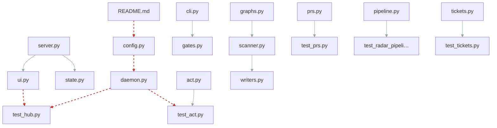

# Change coupling
_Generated 2026-06-10 18:45 UTC_

Files that change together (≥4 shared commits, ≥50% degree).
Coupled pairs **without** an import edge are hidden seams — an implicit
contract the dependency graph can't see.

> [!warning] 5 hidden seam(s): coupled in history, no import edge
> - `repo_scan/hub/daemon.py` ↔ `tests/test_act.py` (64% over 7 commits)
> - `repo_scan/config.py` ↔ `repo_scan/hub/daemon.py` (55% over 8 commits)
> - `README.md` ↔ `repo_scan/config.py` (51% over 11 commits)
> - `repo_scan/hub/ui.py` ↔ `tests/test_hub.py` (50% over 6 commits)
> - `repo_scan/hub/daemon.py` ↔ `tests/test_hub.py` (50% over 6 commits)

| File A | File B | Shared commits | Degree | Import edge |
|--------|--------|----------------|--------|-------------|
| `repo_scan/hub/prs.py` | `tests/test_prs.py` | 4 | 100% | yes |
| `repo_scan/radar/cli.py` | `repo_scan/radar/gates.py` | 5 | 83% | yes |
| `repo_scan/hub/server.py` | `repo_scan/hub/ui.py` | 10 | 80% | yes |
| `repo_scan/tickets.py` | `tests/test_tickets.py` | 4 | 73% | yes |
| `repo_scan/hub/daemon.py` | `tests/test_act.py` | 7 | 64% | **none — seam** |
| `repo_scan/radar/pipeline.py` | `tests/test_radar_pipeline.py` | 6 | 63% | yes |
| `repo_scan/radar/act.py` | `tests/test_act.py` | 5 | 59% | yes |
| `repo_scan/graphs.py` | `repo_scan/scanner.py` | 5 | 56% | yes |
| `repo_scan/config.py` | `repo_scan/hub/daemon.py` | 8 | 55% | **none — seam** |
| `repo_scan/scanner.py` | `repo_scan/writers.py` | 6 | 55% | yes |
| `README.md` | `repo_scan/config.py` | 11 | 51% | **none — seam** |
| `repo_scan/hub/ui.py` | `tests/test_hub.py` | 6 | 50% | **none — seam** |
| `repo_scan/hub/daemon.py` | `tests/test_hub.py` | 6 | 50% | **none — seam** |
| `repo_scan/hub/server.py` | `repo_scan/hub/state.py` | 4 | 50% | yes |
