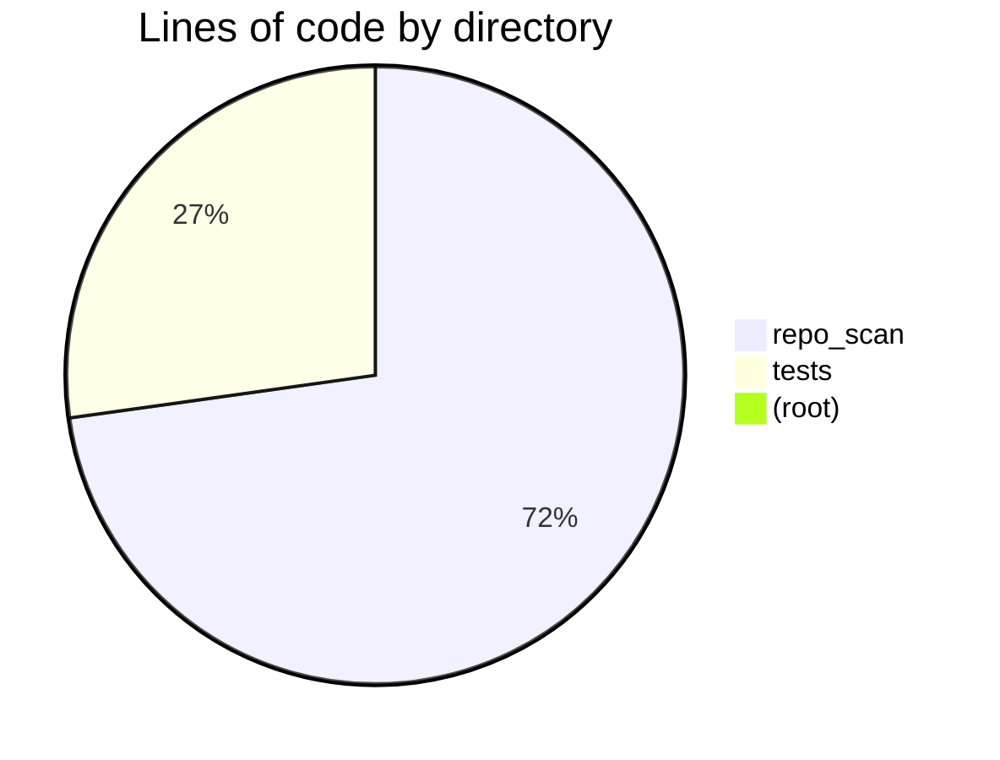
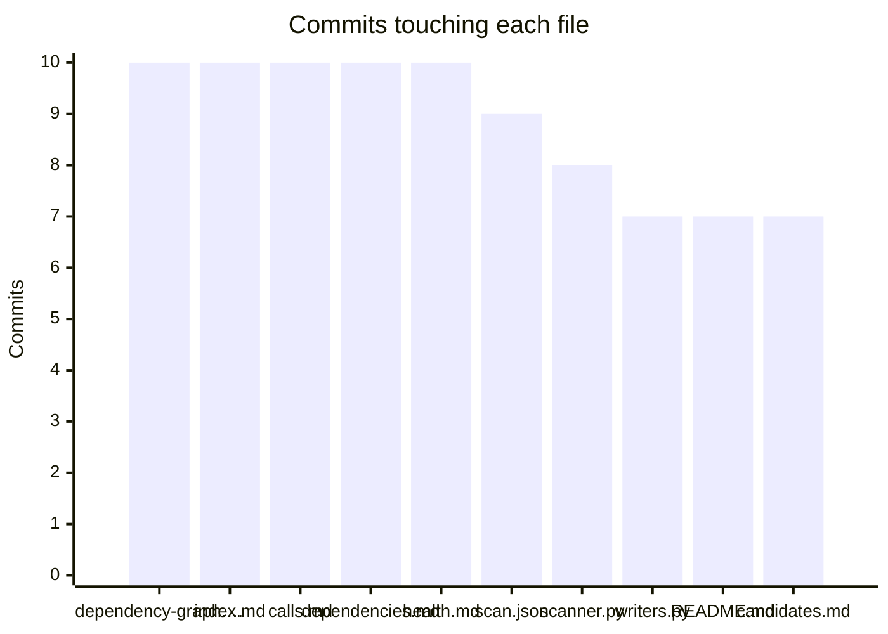

# Health report
_Generated 2026-06-10 01:21 UTC_  |  _Branch: main_  |  _Last commit: 2bc8811 feat: C1 behavioral metrics — change coupling, bus-factor map, code age from one git pass_

## Where the code lives

## File sizes

| File | Lines | Size | Status |
|------|-------|------|--------|
| `repo_scan/writers.py` | 469 | 19.7 KB | *large* |
| `repo_scan/radar/pipeline.py` | 292 | 12.4 KB | ok |
| `repo_scan/tickets.py` | 210 | 10.0 KB | ok |
| `repo_scan/radar/fetchers.py` | 170 | 7.6 KB | ok |
| `repo_scan/radar/sources.py` | 166 | 6.7 KB | ok |
| `repo_scan/handoff.py` | 156 | 5.2 KB | ok |
| `repo_scan/scanner.py` | 146 | 7.0 KB | ok |
| `tests/test_radar_ingest.py` | 141 | 6.0 KB | ok |
| `repo_scan/graphs.py` | 140 | 6.0 KB | ok |
| `repo_scan/radar/research.py` | 136 | 5.3 KB | ok |
| `tests/test_phase_a.py` | 123 | 6.8 KB | ok |
| `tests/test_radar_pipeline.py` | 113 | 5.9 KB | ok |
| `repo_scan/ranking.py` | 106 | 4.8 KB | ok |
| `repo_scan/behavior.py` | 102 | 4.4 KB | ok |
| `tests/test_tickets.py` | 99 | 4.9 KB | ok |
| `repo_scan/trends.py` | 99 | 4.4 KB | ok |
| `tests/test_radar_llm.py` | 95 | 4.6 KB | ok |
| `repo_scan/complexity.py` | 91 | 3.7 KB | ok |
| `repo_scan/radar/llm.py` | 91 | 3.6 KB | ok |
| `tests/test_visuals.py` | 89 | 4.4 KB | ok |
| `repo_scan/radar/gates.py` | 85 | 3.9 KB | ok |
| `tests/test_radar_full.py` | 83 | 4.0 KB | ok |
| `repo_scan/identity.py` | 81 | 3.7 KB | ok |
| `tests/test_scan.py` | 80 | 3.8 KB | ok |
| `repo_scan/utils.py` | 80 | 3.9 KB | ok |
| `repo_scan/radar/cli.py` | 80 | 3.8 KB | ok |
| `tests/test_behavior.py` | 72 | 3.7 KB | ok |
| `repo_scan/languages.py` | 66 | 2.8 KB | ok |
| `repo_scan/__init__.py` | 64 | 1.5 KB | ok |
| `repo_scan/cli.py` | 64 | 2.6 KB | ok |
| `tests/test_trends.py` | 61 | 2.8 KB | ok |
| `tests/test_portability.py` | 55 | 2.7 KB | ok |
| `repo_scan/config.py` | 49 | 1.9 KB | ok |
| `tests/test_radar_gates.py` | 46 | 2.4 KB | ok |
| `repo_scan/digest.py` | 46 | 2.3 KB | ok |
| `tests/test_tests_map.py` | 40 | 2.1 KB | ok |
| `repo_scan/hooks.py` | 37 | 1.2 KB | ok |
| `repo_scan/tests_map.py` | 37 | 1.6 KB | ok |
| `tests/conftest.py` | 28 | 1.1 KB | ok |
| `tests/fake_llm.py` | 27 | 0.9 KB | ok |

## Complexity hotspots

| File | Function | Rank | Score | Line |
|------|----------|------|-------|------|
| `repo_scan/writers.py` | `write_health_report` | D | 28 | 105 |
| `repo_scan/scanner.py` | `scan` | D | 27 | 46 |
| `repo_scan/writers.py` | `write_index` | D | 24 | 294 |
| `repo_scan/tickets.py` | `propose_from_scan` | C | 19 | 107 |
| `repo_scan/graphs.py` | `get_python_dep_edges` | C | 19 | 81 |
| `repo_scan/ranking.py` | `rank_files` | C | 19 | 69 |
| `tests/test_radar_pipeline.py` | `test_loop_happy_path_auto_gates` | C | 19 | 54 |
| `repo_scan/languages.py` | `get_line_counts` | C | 18 | 39 |
| `repo_scan/ranking.py` | `_pagerank` | C | 15 | 36 |
| `repo_scan/identity.py` | `detect_entry_points` | C | 14 | 17 |
| `repo_scan/radar/sources.py` | `rebuild_research_index` | C | 14 | 153 |
| `tests/test_trends.py` | `test_scan_writes_trend_and_delta_on_second_run` | C | 14 | 59 |
| `repo_scan/digest.py` | `write_digest` | C | 13 | 10 |
| `repo_scan/graphs.py` | `edges_to_mermaid` | C | 13 | 13 |
| `repo_scan/graphs.py` | `get_ts_dep_edges` | C | 12 | 53 |
| `repo_scan/graphs.py` | `get_c_call_graph_mermaid` | C | 12 | 134 |
| `repo_scan/behavior.py` | `analyze_history` | C | 12 | 42 |
| `repo_scan/complexity.py` | `get_lizard_complexity` | C | 11 | 59 |
| `repo_scan/radar/pipeline.py` | `write_analysis` | C | 11 | 96 |

## Git churn (most changed files)

| File | Commits |
|------|---------|
| `docs/architecture/dependency-graph.md` | 10 |
| `docs/index.md` | 10 |
| `docs/reports/calls.md` | 10 |
| `docs/reports/dependencies.md` | 10 |
| `docs/reports/health.md` | 10 |
| `docs/scan.json` | 9 |
| `repo_scan/scanner.py` | 8 |
| `repo_scan/writers.py` | 7 |
| `README.md` | 7 |
| `docs/research/candidates.md` | 7 |
| `docs/digest.md` | 6 |
| `pyproject.toml` | 5 |
| `setup.py` | 5 |
| `docs/research/index.md` | 4 |
| `docs/research/tags.md` | 4 |

## Knowledge map (bus factor)

_Top-author share near 100% on an active file = knowledge silo._

| File | Commits | Authors | Top author share | Age (days) | Flag |
|------|---------|---------|------------------|------------|------|
| `repo_scan/scanner.py` | 8 | 1 | 100% | 0 | silo |
| `repo_scan/writers.py` | 7 | 1 | 100% | 0 | silo |
| `README.md` | 7 | 1 | 100% | 0 | silo |
| `pyproject.toml` | 5 | 1 | 100% | 0 | silo |
| `setup.py` | 5 | 1 | 100% | 0 | silo |
| `repo_scan/graphs.py` | 3 | 1 | 100% | 0 | — |
| `repo_scan/languages.py` | 3 | 1 | 100% | 0 | — |
| `repo_scan/radar/sources.py` | 3 | 1 | 100% | 0 | — |
| `repo_scan/radar/pipeline.py` | 3 | 1 | 100% | 0 | — |
| `tests/test_radar_pipeline.py` | 3 | 1 | 100% | 0 | — |
| `repo_scan/config.py` | 2 | 1 | 100% | 0 | — |
| `repo_scan/__init__.py` | 2 | 1 | 100% | 0 | — |
| `repo_scan/complexity.py` | 2 | 1 | 100% | 0 | — |
| `tests/test_portability.py` | 2 | 1 | 100% | 0 | — |
| `repo_scan/utils.py` | 2 | 1 | 100% | 0 | — |
