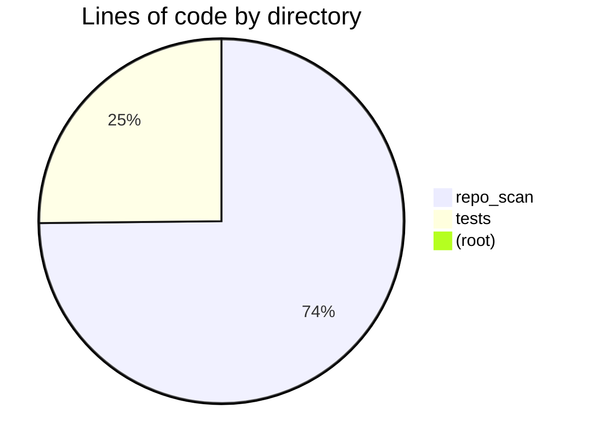
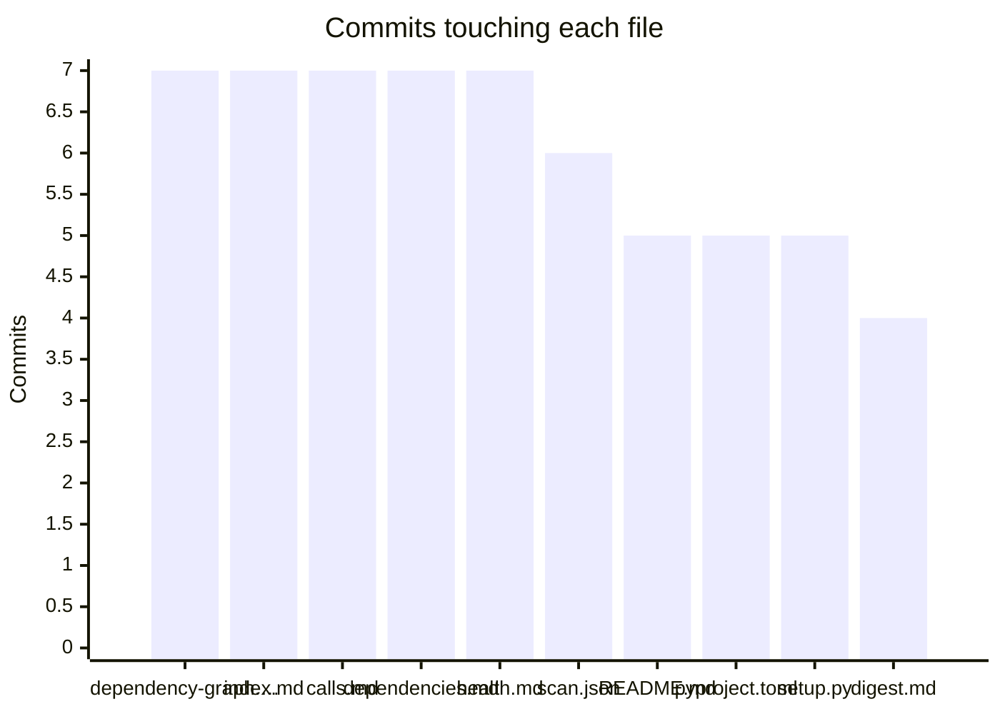

# Health report
_Generated 2026-06-10 00:12 UTC_  |  _Branch: main_  |  _Last commit: 5abf40e feat: visual layer for generated docs — Mermaid charts, callouts, PageRank-tinted dep graphs_

## Where the code lives

## File sizes

| File | Lines | Size | Status |
|------|-------|------|--------|
| `repo_scan/writers.py` | 393 | 16.2 KB | *large* |
| `repo_scan/radar/pipeline.py` | 292 | 12.4 KB | ok |
| `repo_scan/radar/fetchers.py` | 170 | 7.6 KB | ok |
| `repo_scan/radar/sources.py` | 166 | 6.7 KB | ok |
| `repo_scan/handoff.py` | 156 | 5.2 KB | ok |
| `tests/test_radar_ingest.py` | 141 | 6.0 KB | ok |
| `repo_scan/graphs.py` | 137 | 5.6 KB | ok |
| `repo_scan/radar/research.py` | 136 | 5.3 KB | ok |
| `tests/test_phase_a.py` | 123 | 6.8 KB | ok |
| `repo_scan/scanner.py` | 118 | 5.4 KB | ok |
| `tests/test_radar_pipeline.py` | 113 | 5.9 KB | ok |
| `repo_scan/ranking.py` | 106 | 4.8 KB | ok |
| `tests/test_radar_llm.py` | 95 | 4.6 KB | ok |
| `repo_scan/radar/llm.py` | 91 | 3.6 KB | ok |
| `tests/test_visuals.py` | 89 | 4.4 KB | ok |
| `repo_scan/radar/gates.py` | 85 | 3.9 KB | ok |
| `tests/test_radar_full.py` | 83 | 4.0 KB | ok |
| `repo_scan/identity.py` | 81 | 3.7 KB | ok |
| `tests/test_scan.py` | 80 | 3.8 KB | ok |
| `repo_scan/utils.py` | 80 | 3.9 KB | ok |
| `repo_scan/radar/cli.py` | 80 | 3.8 KB | ok |
| `repo_scan/__init__.py` | 64 | 1.4 KB | ok |
| `repo_scan/cli.py` | 64 | 2.6 KB | ok |
| `repo_scan/languages.py` | 61 | 2.4 KB | ok |
| `tests/test_radar_gates.py` | 46 | 2.4 KB | ok |
| `repo_scan/digest.py` | 46 | 2.3 KB | ok |
| `repo_scan/config.py` | 42 | 1.6 KB | ok |
| `repo_scan/hooks.py` | 37 | 1.2 KB | ok |
| `repo_scan/complexity.py` | 29 | 1.1 KB | ok |
| `tests/conftest.py` | 28 | 1.1 KB | ok |
| `tests/fake_llm.py` | 27 | 0.9 KB | ok |
| `repo_scan/churn.py` | 14 | 0.6 KB | ok |
| `pyproject.toml` | 14 | 0.4 KB | ok |
| `setup.py` | 13 | 0.3 KB | ok |
| `repo_scan/radar/__init__.py` | 5 | 0.2 KB | ok |
| `README.md` | 0 | 5.8 KB | ok |

## Complexity hotspots

| File | Function | Rank | Score | Line |
|------|----------|------|-------|------|
| `repo_scan/writers.py` | `write_index` | D | 23 | 231 |
| `repo_scan/scanner.py` | `scan` | C | 20 | 41 |
| `repo_scan/writers.py` | `write_health_report` | C | 20 | 104 |
| `repo_scan/graphs.py` | `get_python_dep_edges` | C | 19 | 75 |
| `repo_scan/ranking.py` | `rank_files` | C | 19 | 69 |
| `tests/test_radar_pipeline.py` | `test_loop_happy_path_auto_gates` | C | 19 | 54 |
| `repo_scan/languages.py` | `get_line_counts` | C | 16 | 31 |
| `repo_scan/ranking.py` | `_pagerank` | C | 15 | 36 |
| `repo_scan/identity.py` | `detect_entry_points` | C | 14 | 17 |
| `repo_scan/radar/sources.py` | `rebuild_research_index` | C | 14 | 153 |
| `repo_scan/digest.py` | `write_digest` | C | 13 | 10 |
| `repo_scan/graphs.py` | `edges_to_mermaid` | C | 13 | 13 |
| `repo_scan/graphs.py` | `get_c_call_graph_mermaid` | C | 12 | 128 |
| `repo_scan/graphs.py` | `get_ts_dep_edges` | C | 11 | 53 |
| `repo_scan/radar/pipeline.py` | `write_analysis` | C | 11 | 96 |

## Git churn (most changed files)

| File | Commits |
|------|---------|
| `docs/architecture/dependency-graph.md` | 7 |
| `docs/index.md` | 7 |
| `docs/reports/calls.md` | 7 |
| `docs/reports/dependencies.md` | 7 |
| `docs/reports/health.md` | 7 |
| `docs/scan.json` | 6 |
| `README.md` | 5 |
| `pyproject.toml` | 5 |
| `setup.py` | 5 |
| `docs/digest.md` | 4 |
| `docs/research/candidates.md` | 4 |
| `repo_scan/radar/pipeline.py` | 3 |
| `repo_scan/scanner.py` | 3 |
| `repo_scan/writers.py` | 3 |
| `tests/test_radar_pipeline.py` | 3 |
