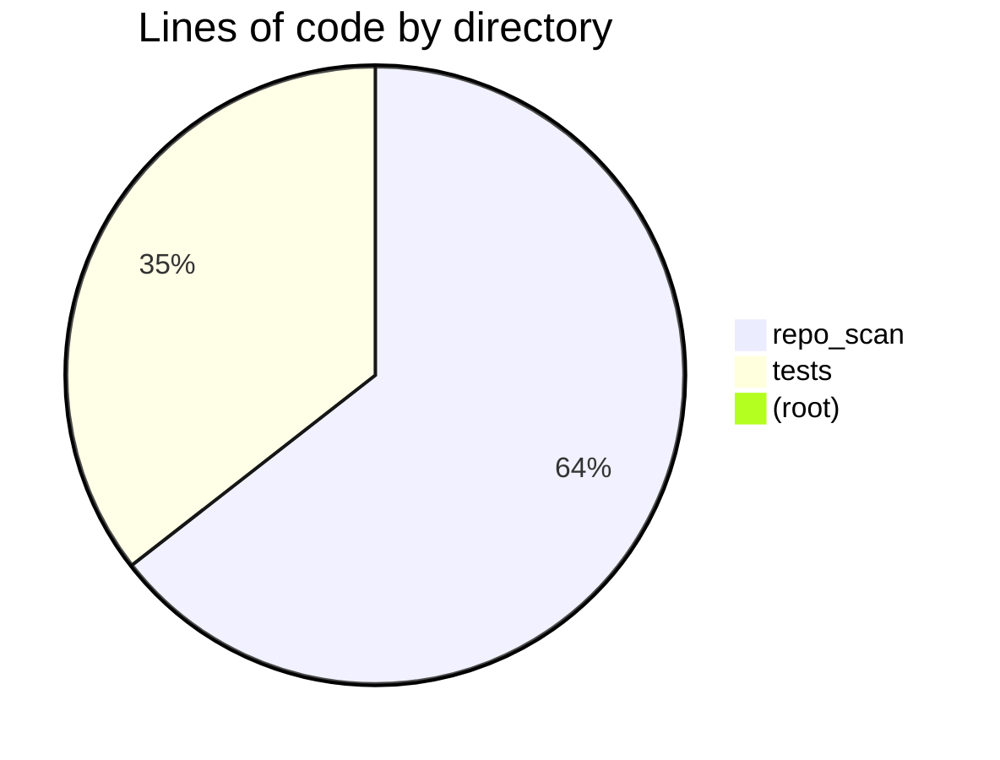
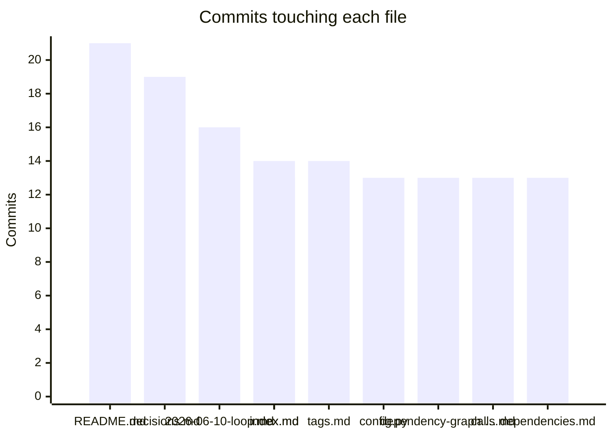

# Health report
_Generated 2026-06-10 09:06 UTC_  |  _Branch: main_  |  _Last commit: 6a23752 vault: loop artifacts — tkt-0006_

## Where the code lives

## File sizes

| File | Lines | Size | Status |
|------|-------|------|--------|
| `repo_scan/tickets.py` | 508 | 24.3 KB | *large* |
| `repo_scan/writers.py` | 485 | 21.5 KB | *large* |
| `repo_scan/radar/act.py` | 445 | 22.3 KB | *large* |
| `repo_scan/hub/ui.py` | 439 | 22.7 KB | *large* |
| `repo_scan/radar/pipeline.py` | 409 | 18.6 KB | *large* |
| `tests/test_hub.py` | 403 | 22.1 KB | *large* |
| `repo_scan/hub/daemon.py` | 327 | 16.4 KB | *large* |
| `repo_scan/hub/server.py` | 282 | 13.5 KB | ok |
| `tests/test_act.py` | 260 | 14.4 KB | ok |
| `repo_scan/radar/llm.py` | 248 | 11.0 KB | ok |
| `repo_scan/hub/tui.py` | 218 | 10.4 KB | ok |
| `repo_scan/scanner.py` | 217 | 10.0 KB | ok |
| `repo_scan/hub/state.py` | 190 | 8.4 KB | ok |
| `tests/test_intent_governance.py` | 184 | 9.8 KB | ok |
| `tests/test_languages.py` | 174 | 7.8 KB | ok |
| `repo_scan/radar/fetchers.py` | 170 | 7.6 KB | ok |
| `repo_scan/radar/sources.py` | 166 | 6.7 KB | ok |
| `tests/test_scanner_snapshots.py` | 165 | 8.3 KB | ok |
| `tests/test_radar_pipeline.py` | 162 | 8.5 KB | ok |
| `repo_scan/handoff.py` | 156 | 5.2 KB | ok |
| `tests/test_tickets.py` | 151 | 7.3 KB | ok |
| `tests/test_prs.py` | 149 | 7.1 KB | ok |
| `repo_scan/hub/prs.py` | 147 | 6.8 KB | ok |
| `tests/test_radar_ingest.py` | 141 | 6.0 KB | ok |
| `repo_scan/graphs.py` | 140 | 6.0 KB | ok |
| `repo_scan/radar/research.py` | 136 | 5.4 KB | ok |
| `tests/test_phase_a.py` | 123 | 6.8 KB | ok |
| `repo_scan/radar/gates.py` | 120 | 5.9 KB | ok |
| `tests/test_llm_routing.py` | 116 | 5.3 KB | ok |
| `repo_scan/radar/cli.py` | 110 | 5.7 KB | ok |
| `tests/test_hub_ui.py` | 109 | 5.1 KB | ok |
| `repo_scan/ranking.py` | 106 | 4.8 KB | ok |
| `tests/test_writers_snapshots.py` | 104 | 5.6 KB | ok |
| `tests/test_tickets_workflow.py` | 102 | 5.4 KB | ok |
| `repo_scan/behavior.py` | 102 | 4.4 KB | ok |
| `repo_scan/languages.py` | 100 | 3.6 KB | ok |
| `tests/test_tui.py` | 100 | 5.3 KB | ok |
| `repo_scan/trends.py` | 99 | 4.4 KB | ok |
| `tests/test_radar_llm.py` | 95 | 4.6 KB | ok |
| `repo_scan/complexity.py` | 91 | 3.7 KB | ok |

## Complexity hotspots

| File | Function | Rank | Score | Line |
|------|----------|------|-------|------|
| `repo_scan/radar/act.py` | `cmd_act` | F | 52 | 251 |
| `repo_scan/hub/daemon.py` | `daemon_tick` | E | 38 | 247 |
| `repo_scan/radar/llm.py` | `complete` | D | 28 | 157 |
| `repo_scan/hub/tui.py` | `frame_lines` | D | 25 | 92 |
| `repo_scan/tickets.py` | `propose_from_scan` | C | 19 | 235 |
| `repo_scan/graphs.py` | `get_python_dep_edges` | C | 19 | 81 |
| `repo_scan/ranking.py` | `rank_files` | C | 19 | 69 |
| `repo_scan/radar/pipeline.py` | `cmd_loop` | C | 19 | 237 |
| `repo_scan/tickets.py` | `derive_card` | C | 18 | 100 |
| `repo_scan/hub/server.py` | `build_state` | C | 18 | 42 |
| `repo_scan/ranking.py` | `_pagerank` | C | 15 | 36 |
| `repo_scan/tickets.py` | `generate_tickets` | C | 14 | 464 |
| `repo_scan/tickets.py` | `tickets_main` | C | 14 | 513 |
| `repo_scan/identity.py` | `detect_entry_points` | C | 14 | 17 |
| `repo_scan/radar/sources.py` | `rebuild_research_index` | C | 14 | 153 |
| `tests/test_trends.py` | `test_scan_writes_trend_and_delta_on_second_run` | C | 14 | 59 |
| `tests/test_act.py` | `test_act_happy_path_commits_on_branch` | C | 14 | 86 |
| `repo_scan/digest.py` | `write_digest` | C | 13 | 10 |
| `repo_scan/graphs.py` | `edges_to_mermaid` | C | 13 | 13 |
| `repo_scan/radar/gates.py` | `gate` | C | 13 | 88 |

## Git churn (most changed files)

| File | Commits |
|------|---------|
| `README.md` | 21 |
| `docs/research/decisions.md` | 19 |
| `docs/changelog/2026-06-10-loop.md` | 16 |
| `docs/research/index.md` | 14 |
| `docs/research/tags.md` | 14 |
| `repo_scan/config.py` | 13 |
| `docs/architecture/dependency-graph.md` | 13 |
| `docs/index.md` | 13 |
| `docs/reports/calls.md` | 13 |
| `docs/reports/dependencies.md` | 13 |
| `docs/reports/health.md` | 13 |
| `docs/scan.json` | 12 |
| `repo_scan/hub/daemon.py` | 11 |
| `docs/tickets/board.md` | 11 |
| `repo_scan/scanner.py` | 11 |

## Knowledge map (bus factor)

_Top-author share near 100% on an active file = knowledge silo._

| File | Commits | Authors | Top author share | Age (days) | Flag |
|------|---------|---------|------------------|------------|------|
| `repo_scan/config.py` | 13 | 1 | 100% | 0 | silo |
| `repo_scan/hub/daemon.py` | 11 | 1 | 100% | 0 | silo |
| `repo_scan/radar/pipeline.py` | 10 | 1 | 100% | 0 | silo |
| `repo_scan/writers.py` | 8 | 1 | 100% | 0 | silo |
| `tests/test_act.py` | 7 | 1 | 100% | 0 | silo |
| `repo_scan/radar/llm.py` | 7 | 1 | 100% | 0 | silo |
| `pyproject.toml` | 7 | 1 | 100% | 0 | silo |
| `repo_scan/radar/act.py` | 6 | 1 | 100% | 0 | silo |
| `repo_scan/radar/gates.py` | 5 | 1 | 100% | 0 | silo |
| `repo_scan/radar/cli.py` | 5 | 1 | 100% | 0 | silo |
| `repo_scan/hub/prs.py` | 3 | 1 | 100% | 0 | — |
| `tests/test_prs.py` | 3 | 1 | 100% | 0 | — |
| `repo_scan/hub/state.py` | 3 | 1 | 100% | 0 | — |
| `repo_scan/radar/research.py` | 3 | 1 | 100% | 0 | — |
| `repo_scan/graphs.py` | 3 | 1 | 100% | 0 | — |
