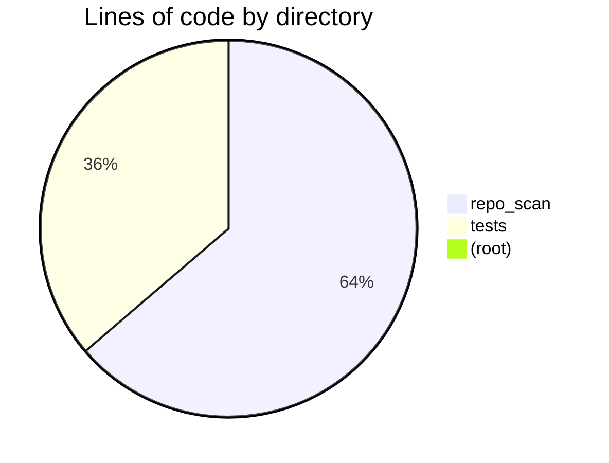
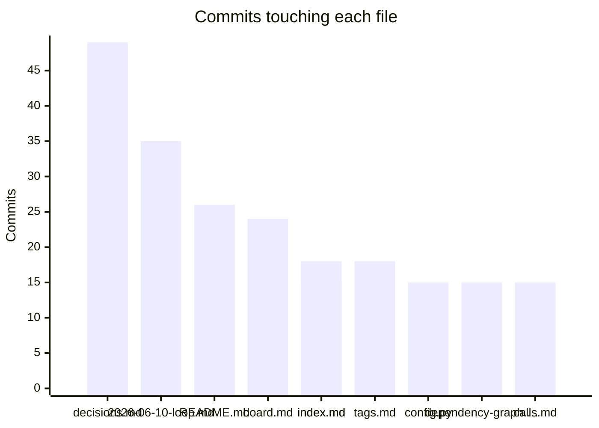

# Health report
_Generated 2026-06-10 17:51 UTC_  |  _Branch: main_  |  _Last commit: 316c538 radar: implement tkt-0015 — Hidden seam: repo_scan/radar/cli.py <-> repo_scan/radar/gate (#14)_

## Where the code lives

## File sizes

| File | Lines | Size | Status |
|------|-------|------|--------|
| `repo_scan/hub/ui.py` | 708 | 33.1 KB | **critical** |
| `repo_scan/tickets.py` | 654 | 30.9 KB | **critical** |
| `repo_scan/hub/prs.py` | 530 | 23.5 KB | *large* |
| `repo_scan/radar/act.py` | 523 | 25.8 KB | *large* |
| `repo_scan/radar/pipeline.py` | 503 | 23.0 KB | *large* |
| `repo_scan/writers.py` | 498 | 22.1 KB | *large* |
| `repo_scan/hub/daemon.py` | 395 | 18.2 KB | *large* |
| `tests/test_daemon.py` | 386 | 19.6 KB | *large* |
| `tests/test_hub.py` | 364 | 19.0 KB | *large* |
| `repo_scan/hub/server.py` | 331 | 15.5 KB | *large* |
| `repo_scan/graphs.py` | 282 | 12.3 KB | ok |
| `repo_scan/radar/research.py` | 262 | 11.1 KB | ok |
| `repo_scan/radar/llm.py` | 253 | 11.3 KB | ok |
| `tests/test_prs.py` | 238 | 10.9 KB | ok |
| `tests/test_tickets.py` | 230 | 10.8 KB | ok |
| `repo_scan/scanner.py` | 222 | 10.0 KB | ok |
| `repo_scan/hub/tui.py` | 218 | 10.4 KB | ok |
| `repo_scan/hub/state.py` | 209 | 9.3 KB | ok |
| `tests/test_act.py` | 203 | 11.0 KB | ok |
| `repo_scan/radar/sources.py` | 189 | 7.8 KB | ok |
| `tests/test_languages.py` | 174 | 7.8 KB | ok |
| `repo_scan/radar/fetchers.py` | 170 | 7.6 KB | ok |
| `tests/test_scanner_snapshots.py` | 167 | 8.4 KB | ok |
| `tests/test_radar_pipeline.py` | 162 | 8.5 KB | ok |
| `tests/test_report_pipeline.py` | 162 | 5.8 KB | ok |
| `repo_scan/handoff.py` | 156 | 5.2 KB | ok |
| `tests/test_intent_governance.py` | 151 | 8.1 KB | ok |
| `repo_scan/radar/gates.py` | 147 | 7.0 KB | ok |
| `tests/test_hub_contract.py` | 144 | 5.4 KB | ok |
| `tests/test_visuals.py` | 139 | 6.5 KB | ok |
| `repo_scan/radar/cli.py` | 125 | 5.8 KB | ok |
| `tests/test_llm_routing.py` | 124 | 5.8 KB | ok |
| `tests/test_phase_a.py` | 123 | 6.8 KB | ok |
| `repo_scan/hub/contract.py` | 114 | 3.6 KB | ok |
| `tests/test_hub_ui.py` | 109 | 5.2 KB | ok |
| `tests/test_sources.py` | 108 | 5.2 KB | ok |
| `tests/test_writers_snapshots.py` | 106 | 5.8 KB | ok |
| `repo_scan/ranking.py` | 106 | 4.8 KB | ok |
| `tests/test_tickets_workflow.py` | 102 | 5.4 KB | ok |
| `repo_scan/behavior.py` | 102 | 4.4 KB | ok |

## Complexity hotspots

| File | Function | Rank | Score | Line |
|------|----------|------|-------|------|
| `repo_scan/radar/act.py` | `cmd_act` | F | 54 | 324 |
| `repo_scan/hub/prs.py` | `remediate_pr` | E | 33 | 469 |
| `repo_scan/radar/llm.py` | `complete` | D | 28 | 163 |
| `repo_scan/hub/tui.py` | `frame_lines` | D | 25 | 92 |
| `repo_scan/hub/prs.py` | `_agent_remediate_pr` | D | 25 | 343 |
| `repo_scan/hub/server.py` | `build_state` | D | 21 | 56 |
| `repo_scan/tickets.py` | `propose_from_scan` | C | 19 | 303 |
| `repo_scan/ranking.py` | `rank_files` | C | 19 | 69 |
| `repo_scan/tickets.py` | `derive_card` | C | 18 | 108 |
| `repo_scan/radar/research.py` | `_snapshot_delta_lines` | C | 18 | 144 |
| `repo_scan/graphs.py` | `get_python_dep_edges` | C | 17 | 236 |
| `repo_scan/radar/research.py` | `repo_snapshot` | C | 17 | 68 |
| `repo_scan/tickets.py` | `generate_tickets` | C | 16 | 532 |
| `repo_scan/hub/gate_drawer.py` | `enrich_gate` | C | 16 | 71 |
| `repo_scan/hub/prs.py` | `_failed_ci_details` | C | 16 | 214 |
| `repo_scan/ranking.py` | `_pagerank` | C | 15 | 36 |
| `repo_scan/radar/research.py` | `_top_seam_pair` | C | 15 | 169 |
| `tests/test_radar_cli_gates.py` | `test_gate_cli_parent_choices_match_gate_modes` | C | 15 | 44 |
| `repo_scan/tickets.py` | `record_merge_verification` | C | 14 | 614 |
| `repo_scan/tickets.py` | `tickets_main` | C | 14 | 677 |

## Git churn (most changed files)

| File | Commits |
|------|---------|
| `docs/research/decisions.md` | 49 |
| `docs/changelog/2026-06-10-loop.md` | 35 |
| `README.md` | 26 |
| `docs/tickets/board.md` | 24 |
| `docs/research/index.md` | 18 |
| `docs/research/tags.md` | 18 |
| `repo_scan/config.py` | 15 |
| `docs/architecture/dependency-graph.md` | 15 |
| `docs/index.md` | 15 |
| `docs/reports/calls.md` | 15 |
| `docs/reports/dependencies.md` | 15 |
| `docs/reports/health.md` | 15 |
| `docs/changelog/2026-06-10-act.md` | 14 |
| `docs/scan.json` | 14 |
| `repo_scan/hub/ui.py` | 13 |

## Knowledge map (bus factor)

_Top-author share near 100% on an active file = knowledge silo._

| File | Commits | Authors | Top author share | Age (days) | Flag |
|------|---------|---------|------------------|------------|------|
| `repo_scan/radar/act.py` | 8 | 1 | 100% | 0 | silo |
| `repo_scan/radar/llm.py` | 8 | 1 | 100% | 0 | silo |
| `pyproject.toml` | 7 | 1 | 100% | 0 | silo |
| `repo_scan/hub/state.py` | 4 | 1 | 100% | 0 | — |
| `repo_scan/hub/prs.py` | 4 | 1 | 100% | 0 | — |
| `tests/test_prs.py` | 4 | 1 | 100% | 0 | — |
| `repo_scan/radar/research.py` | 4 | 1 | 100% | 0 | — |
| `tests/test_hub_ui.py` | 3 | 1 | 100% | 0 | — |
| `tests/test_llm_routing.py` | 3 | 1 | 100% | 0 | — |
| `tests/test_report_pipeline.py` | 2 | 1 | 100% | 0 | — |
| `repo_scan/report_pipeline.py` | 2 | 1 | 100% | 0 | — |
| `tests/test_scanner_snapshots.py` | 2 | 1 | 100% | 0 | — |
| `repo_scan/hub/notify.py` | 2 | 1 | 100% | 0 | — |
| `repo_scan/cli.py` | 2 | 1 | 100% | 0 | — |
| `repo_scan/__init__.py` | 2 | 1 | 100% | 0 | — |

## Action items

> [!warning] 2 file(s) over the 600-line critical threshold
> - [ ] Split `repo_scan/hub/ui.py` (708 lines)
> - [ ] Split `repo_scan/tickets.py` (654 lines)
