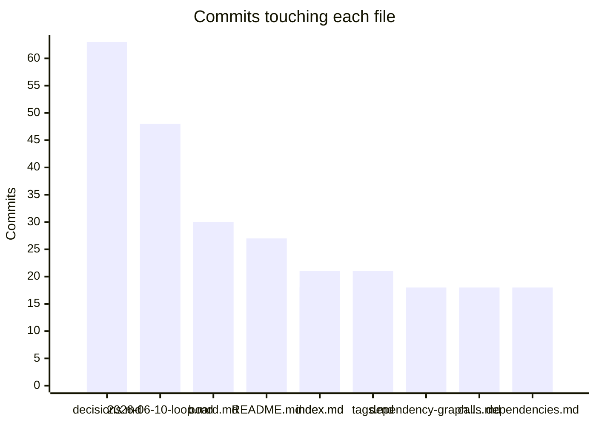

# Health report
_Generated 2026-06-10 21:57 UTC_  |  _Branch: main_  |  _Last commit: 138de87 vault: loop artifacts — tkt-0018_

> [!warning] Vault provenance: 0/143 docs fully traced (0%)
> Untracked ranked code: 9
> Stale docs: 0

## Vault health

| Metric | Value |
|--------|-------|
| Coverage | 0% (0/143) |
| Untracked code (ranked) | 9 |
| Stale docs | 0 |
| Orphan analysiss | 21 |
| Orphan sources | 65 |
| Orphan specs | 21 |
| Orphan tickets | 36 |

## Where the code lives

## File sizes

| File | Lines | Size | Status |
|------|-------|------|--------|
| `repo_scan/hub/static/mermaid.min.js` | 2028 | 3258.6 KB | **critical** |
| `repo_scan/writers.py` | 543 | 24.0 KB | *large* |
| `repo_scan/radar/act.py` | 539 | 26.7 KB | *large* |
| `repo_scan/hub/prs.py` | 530 | 23.5 KB | *large* |
| `repo_scan/radar/pipeline.py` | 515 | 23.5 KB | *large* |
| `repo_scan/hub/telemetry.py` | 407 | 17.0 KB | *large* |
| `tests/test_hub.py` | 389 | 20.2 KB | *large* |
| `repo_scan/hub/server.py` | 378 | 17.7 KB | *large* |
| `repo_scan/hub/daemon.py` | 373 | 16.9 KB | *large* |
| `repo_scan/hub/graph.py` | 340 | 13.4 KB | *large* |
| `tests/test_daemon.py` | 337 | 17.1 KB | *large* |
| `repo_scan/graphs.py` | 282 | 12.3 KB | ok |
| `repo_scan/radar/llm.py` | 272 | 12.1 KB | ok |
| `repo_scan/provenance.py` | 265 | 10.7 KB | ok |
| `repo_scan/radar/research.py` | 265 | 11.4 KB | ok |
| `tests/test_prs.py` | 238 | 10.9 KB | ok |
| `repo_scan/scanner.py` | 235 | 10.5 KB | ok |
| `repo_scan/hub/tui.py` | 233 | 11.1 KB | ok |
| `repo_scan/hub/ui/_graph.py` | 231 | 9.6 KB | ok |
| `tests/test_tickets.py` | 230 | 10.8 KB | ok |
| `tests/test_hub_ui.py` | 214 | 10.1 KB | ok |
| `repo_scan/hub/ui/_css.py` | 213 | 13.0 KB | ok |
| `repo_scan/hub/state.py` | 210 | 9.4 KB | ok |
| `repo_scan/hub/ui/_prs_gates.py` | 209 | 9.7 KB | ok |
| `tests/test_hub_graph.py` | 194 | 8.2 KB | ok |
| `repo_scan/radar/sources.py` | 189 | 7.8 KB | ok |
| `repo_scan/hub/ui/_graph_dashboard.py` | 178 | 8.8 KB | ok |
| `tests/test_languages.py` | 174 | 7.8 KB | ok |
| `repo_scan/radar/fetchers.py` | 170 | 7.6 KB | ok |
| `repo_scan/hub/ui/_activity.py` | 170 | 6.9 KB | ok |
| `repo_scan/hub/ui/_runtime.py` | 169 | 5.6 KB | ok |
| `tests/test_scanner_snapshots.py` | 168 | 8.4 KB | ok |
| `tests/test_act.py` | 165 | 9.2 KB | ok |
| `tests/test_radar_pipeline.py` | 163 | 8.5 KB | ok |
| `repo_scan/radar/gates.py` | 163 | 7.6 KB | ok |
| `tests/test_report_pipeline.py` | 162 | 5.8 KB | ok |
| `repo_scan/handoff.py` | 156 | 5.2 KB | ok |
| `repo_scan/trends.py` | 153 | 6.8 KB | ok |
| `tests/test_intent_governance.py` | 151 | 8.1 KB | ok |
| `tests/test_hub_act_run.py` | 149 | 5.7 KB | ok |

## Complexity hotspots

| File | Function | Rank | Score | Line |
|------|----------|------|-------|------|
| `repo_scan/radar/act.py` | `cmd_act` | F | 54 | 334 |
| `repo_scan/radar/llm.py` | `complete` | E | 38 | 166 |
| `repo_scan/hub/prs.py` | `remediate_pr` | E | 33 | 469 |
| `repo_scan/hub/tui.py` | `frame_lines` | D | 29 | 92 |
| `repo_scan/provenance.py` | `vault_coverage` | D | 27 | 222 |
| `repo_scan/hub/server.py` | `build_state` | D | 27 | 61 |
| `repo_scan/hub/prs.py` | `_agent_remediate_pr` | D | 25 | 343 |
| `repo_scan/provenance.py` | `score_node` | D | 22 | 105 |
| `repo_scan/hub/graph.py` | `_vault_layer` | C | 20 | 131 |
| `repo_scan/ranking.py` | `rank_files` | C | 19 | 69 |
| `repo_scan/tickets/propose.py` | `propose_from_scan` | C | 19 | 4 |
| `repo_scan/radar/research.py` | `_snapshot_delta_lines` | C | 18 | 144 |
| `repo_scan/tickets/parse.py` | `derive_card` | C | 18 | 61 |
| `repo_scan/graphs.py` | `get_python_dep_edges` | C | 17 | 236 |
| `repo_scan/radar/research.py` | `repo_snapshot` | C | 17 | 68 |
| `repo_scan/hub/gate_drawer.py` | `enrich_gate` | C | 16 | 71 |
| `repo_scan/hub/graph.py` | `_code_layer` | C | 16 | 79 |
| `repo_scan/hub/prs.py` | `_failed_ci_details` | C | 16 | 214 |
| `repo_scan/tickets/generation.py` | `generate_tickets` | C | 16 | 13 |
| `tests/test_hub_settings.py` | `test_daemon_imports_hub_settings` | C | 16 | 51 |

## Git churn (most changed files)

| File | Commits |
|------|---------|
| `docs/research/decisions.md` | 63 |
| `docs/changelog/2026-06-10-loop.md` | 48 |
| `docs/tickets/board.md` | 30 |
| `README.md` | 27 |
| `docs/research/index.md` | 21 |
| `docs/research/tags.md` | 21 |
| `docs/architecture/dependency-graph.md` | 18 |
| `docs/index.md` | 18 |
| `docs/reports/calls.md` | 18 |
| `docs/reports/dependencies.md` | 18 |
| `docs/reports/health.md` | 18 |
| `docs/changelog/2026-06-10-act.md` | 17 |
| `docs/scan.json` | 17 |
| `repo_scan/config.py` | 16 |
| `docs/research/candidates.md` | 15 |

## Knowledge map (bus factor)

_Top-author share near 100% on an active file = knowledge silo._

| File | Commits | Authors | Top author share | Age (days) | Flag |
|------|---------|---------|------------------|------------|------|
| `repo_scan/radar/act.py` | 9 | 1 | 100% | 0 | silo |
| `repo_scan/radar/llm.py` | 9 | 1 | 100% | 0 | silo |
| `pyproject.toml` | 7 | 1 | 100% | 0 | silo |
| `repo_scan/hub/state.py` | 5 | 1 | 100% | 0 | silo |
| `repo_scan/radar/research.py` | 5 | 1 | 100% | 0 | silo |
| `repo_scan/hub/prs.py` | 4 | 1 | 100% | 0 | — |
| `tests/test_prs.py` | 4 | 1 | 100% | 0 | — |
| `repo_scan/radar/fetchers.py` | 3 | 1 | 100% | 0 | — |
| `tests/test_llm_routing.py` | 3 | 1 | 100% | 0 | — |
| `repo_scan/hub/progress.py` | 2 | 1 | 100% | 0 | — |
| `tests/test_radar_llm.py` | 2 | 1 | 100% | 0 | — |
| `tests/test_daemon.py` | 2 | 1 | 100% | 0 | — |
| `tests/test_hub_contract.py` | 2 | 1 | 100% | 0 | — |
| `tests/test_report_pipeline.py` | 2 | 1 | 100% | 0 | — |
| `repo_scan/report_pipeline.py` | 2 | 1 | 100% | 0 | — |

## Action items

> [!warning] 1 file(s) over the 600-line critical threshold
> - [ ] Split `repo_scan/hub/static/mermaid.min.js` (2028 lines)
