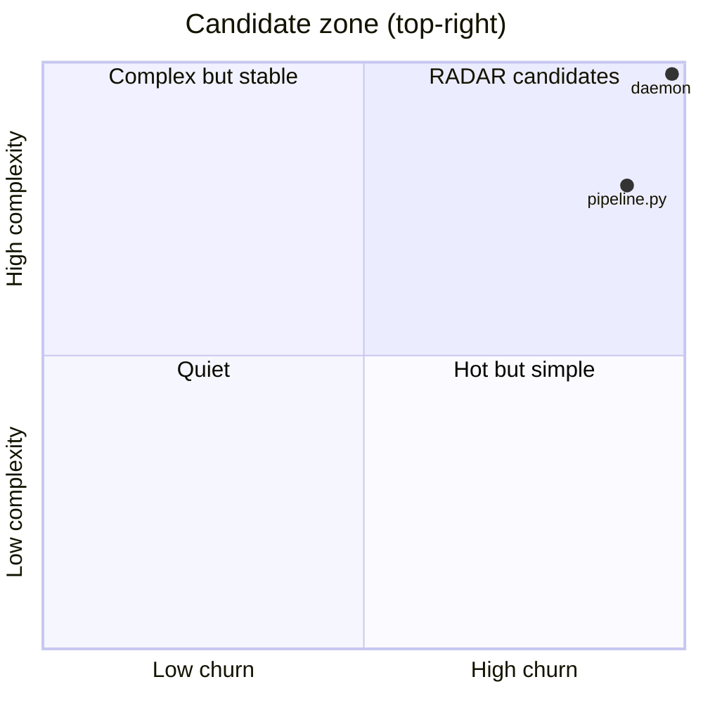

# RADAR candidates
_Generated 2026-06-10 09:06 UTC_

Files that are both high-churn and high-complexity — the most valuable
targets for external research. Consumed by `radar` as a trigger feed.

| File | Commits | Complexity | Tests | Priority |
|------|---------|------------|-------|----------|
| `repo_scan/hub/daemon.py` | 11 | 38 | **no** (2x) | 836 |
| `repo_scan/radar/pipeline.py` | 10 | 30 | yes | 300 |
