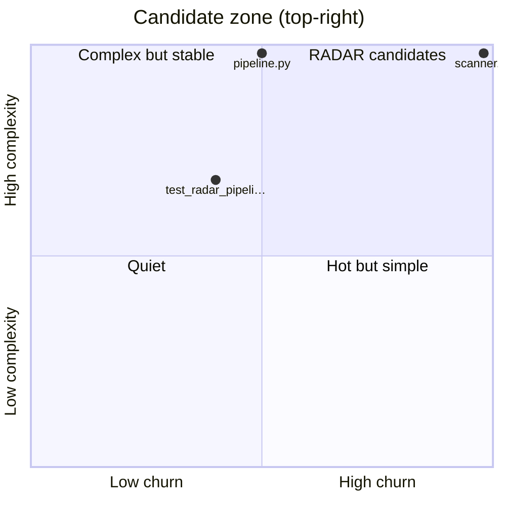

# RADAR candidates
_Generated 2026-06-10 03:06 UTC_

Files that are both high-churn and high-complexity — the most valuable
targets for external research. Consumed by `radar` as a trigger feed.

| File | Commits | Complexity | Tests | Priority |
|------|---------|------------|-------|----------|
| `repo_scan/scanner.py` | 10 | 28 | **no** (2x) | 560 |
| `tests/test_radar_pipeline.py` | 4 | 19 | **no** (2x) | 152 |
| `repo_scan/radar/pipeline.py` | 5 | 28 | yes | 140 |
