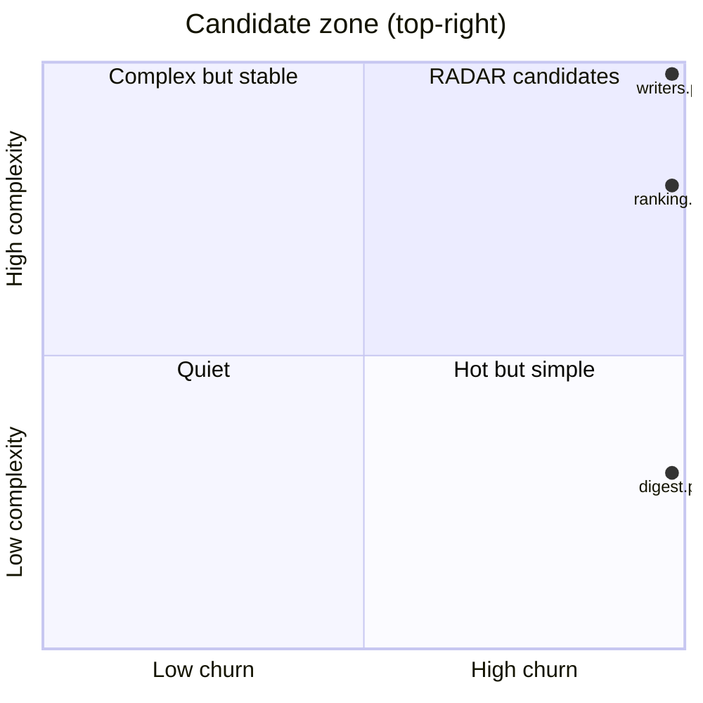

# RADAR candidates
_Generated 2026-06-10 00:09 UTC_

Files that are both high-churn and high-complexity — the most valuable
targets for external research. Consumed by `radar` as a trigger feed.

| File | Commits | Complexity | Priority |
|------|---------|------------|----------|
| `repo_scan/writers.py` | 2 | 43 | 86 |
| `repo_scan/ranking.py` | 2 | 34 | 68 |
| `repo_scan/digest.py` | 2 | 13 | 26 |
