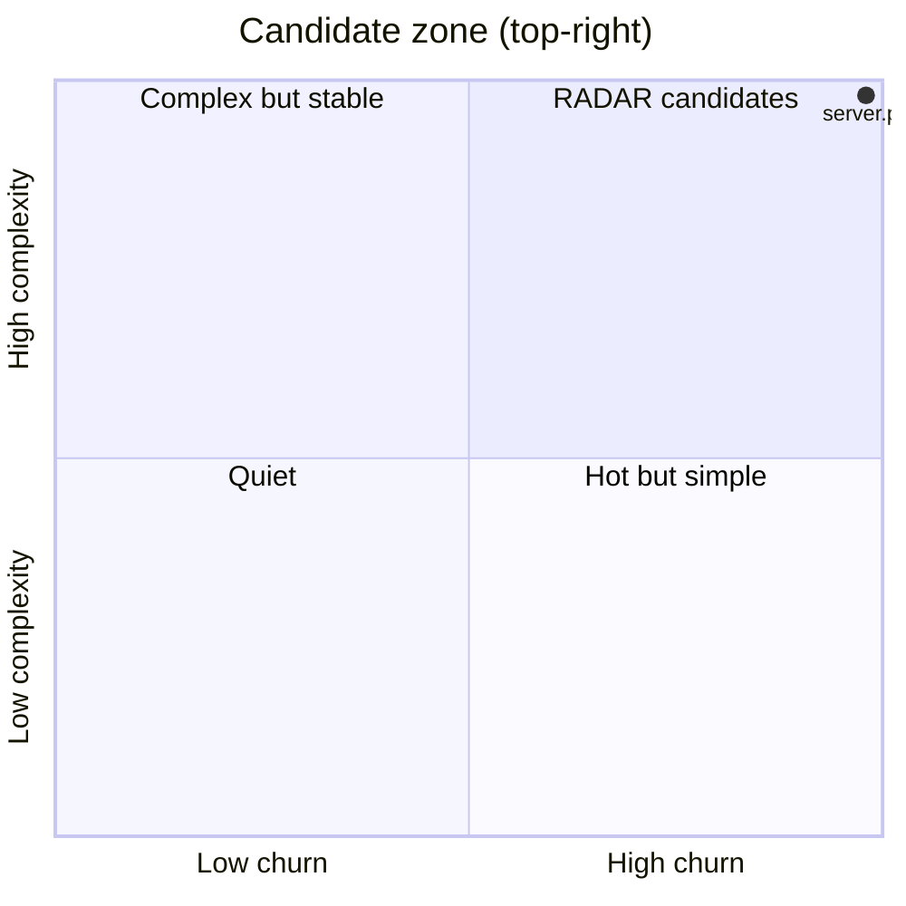

# RADAR candidates
_Generated 2026-06-10 18:45 UTC_

Files that are both high-churn and high-complexity — the most valuable
targets for external research. Consumed by `radar` as a trigger feed.

| File | Commits | Complexity | Tests | Priority |
|------|---------|------------|-------|----------|
| `repo_scan/hub/server.py` | 12 | 21 | **no** (2x) | 504 |
