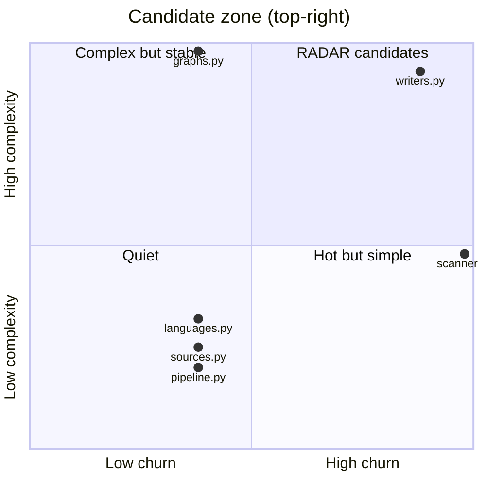

# RADAR candidates
_Generated 2026-06-10 01:21 UTC_

Files that are both high-churn and high-complexity — the most valuable
targets for external research. Consumed by `radar` as a trigger feed.

| File | Commits | Complexity | Tests | Priority |
|------|---------|------------|-------|----------|
| `repo_scan/writers.py` | 7 | 52 | **no** (2x) | 728 |
| `repo_scan/scanner.py` | 8 | 27 | **no** (2x) | 432 |
| `repo_scan/graphs.py` | 3 | 56 | **no** (2x) | 336 |
| `repo_scan/languages.py` | 3 | 18 | **no** (2x) | 108 |
| `repo_scan/radar/sources.py` | 3 | 14 | **no** (2x) | 84 |
| `repo_scan/radar/pipeline.py` | 3 | 11 | yes | 33 |
