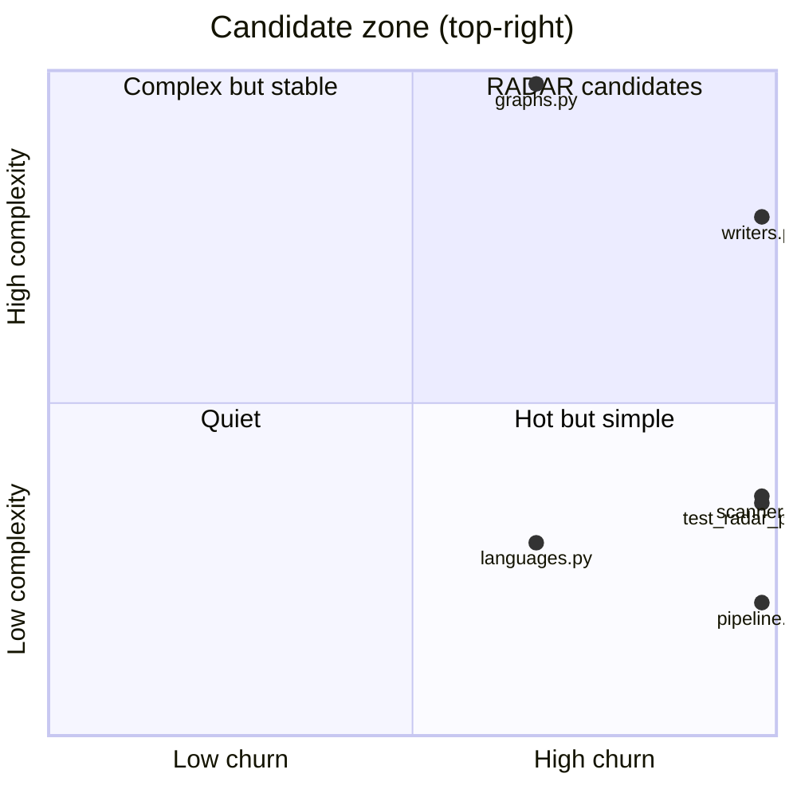

# RADAR candidates
_Generated 2026-06-10 00:12 UTC_

Files that are both high-churn and high-complexity — the most valuable
targets for external research. Consumed by `radar` as a trigger feed.

| File | Commits | Complexity | Priority |
|------|---------|------------|----------|
| `repo_scan/writers.py` | 3 | 43 | 129 |
| `repo_scan/graphs.py` | 2 | 55 | 110 |
| `repo_scan/scanner.py` | 3 | 20 | 60 |
| `tests/test_radar_pipeline.py` | 3 | 19 | 57 |
| `repo_scan/radar/pipeline.py` | 3 | 11 | 33 |
| `repo_scan/languages.py` | 2 | 16 | 32 |
