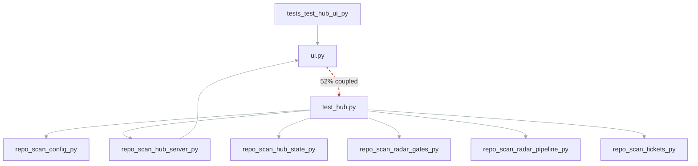

# Hidden seam: repo_scan/hub/ui.py <-> tests/test_hub.py (52% coupled)

## Why

`repo_scan/hub/ui.py` and `tests/test_hub.py` changed together in 6 commits (52% degree) but share no import edge — an implicit contract the dependency graph can't see.

## Acceptance criteria

- [ ] Make the dependency explicit (shared module or import)
- [ ] Coupling degree drops below threshold in coupling.md

## Evidence

_Created 2026-06-10 from scan data_

## Notes

_yours to annotate_
- auto-closed: metric fingerprint cleared on scan
