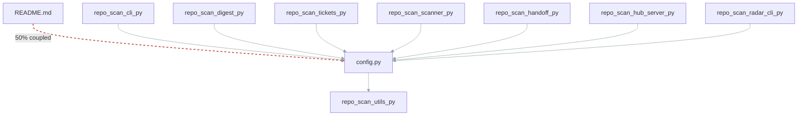

# Hidden seam: README.md <-> repo_scan/config.py (50% coupled)

## Why

`README.md` and `repo_scan/config.py` changed together in 10 commits (50% degree) but share no import edge — an implicit contract the dependency graph can't see.

## Acceptance criteria

- [ ] Make the dependency explicit (shared module or import)
- [ ] Coupling degree drops below threshold in coupling.md

## Evidence

_Created 2026-06-10 from scan data_

## Notes

_yours to annotate_
- auto-closed: metric fingerprint cleared on scan
