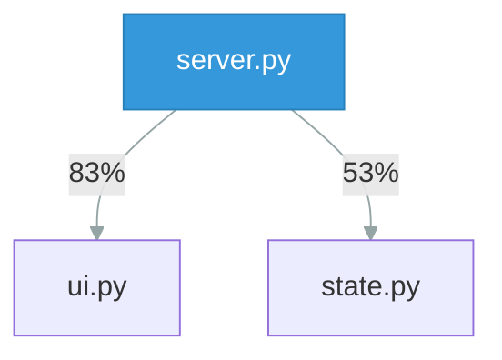

# Refactor repo_scan/hub/server.py (CC 21, 11 commits, untested)

## Why

`repo_scan/hub/server.py` is both high-churn (11 commits) and high-complexity (total CC 21) with no matching test file.

## Acceptance criteria

- [ ] Complexity of every function below rank C
- [ ] Test file exists and passes
- [ ] Trend delta confirms complexity drop

## Evidence

_Created 2026-06-10 from scan data_

## Notes

_yours to annotate_
