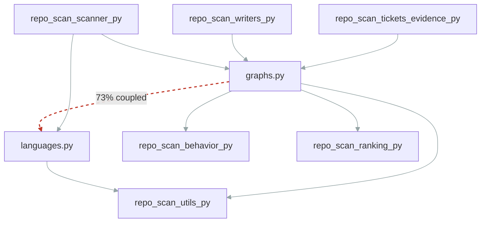

# Hidden seam: repo_scan/graphs.py <-> repo_scan/languages.py (73% coupled)

## Why

`repo_scan/graphs.py` and `repo_scan/languages.py` changed together in 4 commits (73% degree) but share no import edge — an implicit contract the dependency graph can't see.

## Acceptance criteria

- [ ] Make the dependency explicit (shared module or import)
- [ ] Coupling degree drops below threshold in coupling.md

## Evidence

_Created 2026-06-11 from scan data_

## Notes

_yours to annotate_
